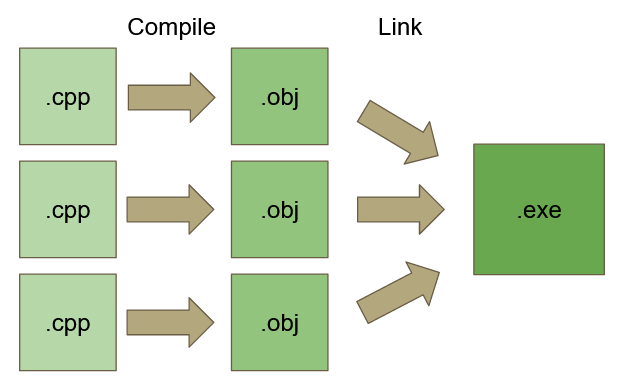
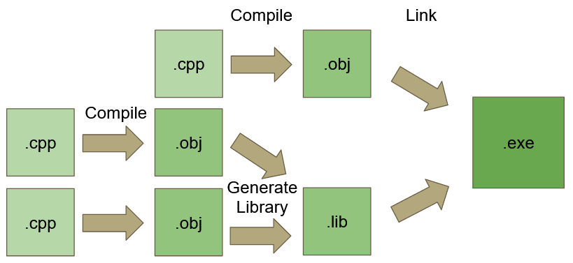

# Overview

The C++ compiler will go through the following stages to build our game

- **Preprocessing**
	- This stage will scan your cpp files for preprocessor directives, marked with \#s, and do something with each one found
- **Compiling**
	- Once all \#s have been dealt with, the compiler will compile the resulting c++ code into an object (.obj) file
- **Linking**
	- Finally, the linker will link all of the object files together

# Preprocessor

Preprocessor directives are marked with \#'s
Some common ones are:
- \#include
- \#define
- \#if
- \#ifdef
- \#ifndef
- etc…

Each preprocessor directive can be expanded into more code or cause chunks of code to be removed from the cpp file

The output of this stage can be thought of as a single long cpp file with no \#'s

#### Example
Before:
```c++
#include "MathFuncs.h"     // This line will be replaced by the contents of the file

void main()
{
	float v = square( 5.0f );
}
```

After:
```c++
float pow(float value, float power);
float sqrt(float value);

void main()
{
	float v = pow( 5.0f, 3.0f );
}
```

#### Example 2
Before:
```c++
#include “isdebug.h”    // isdebug.h is "#define DEBUG 1"

#if DEBUG
void log(char* str)
{
	printf( str );
}
#endif
```

Partway done:
```c++
#define DEBUG 1

#if DEBUG
void log(char* str)
{
	printf( str );
}
#endif
```

After:
```c++
void log(char* str)  
{  
	printf( str );  
}
```

# Compiler

The compiler takes the result of the preprocessor stage for a single cpp file and compiles it.

Compiling refers to the process of turning high-level code (C++) into lower-level code (machine code).

Each cpp file is treated as a single object and each file will get compiled into a single .obj file.

.obj files will contain symbols (function and variable names) that will be used later in the linking stage.

Since each cpp file must stand on it’s own and gets processed from top to bottom, all functions/classes/variables must be declared before they can be used. See [Declarations and Definitions](../C++%20Basics/Declarations%20and%20Definitions.md).

For example, this is necessary so the compiler can verify the correct arguments are passed into the function.

The definition (body) of the function doesn’t need to exist at this point, it will be found during the linking stage. If it isn't found, the linker will produce an error telling you a matching symbol wasn't found.

#### Object (.obj) Files
- Each .cpp file get compiled into an object (.obj) file    
- Object files contain machine language code    
- They usually rely on other object files for other code and data    
- The machine code in object files isn’t executable

# Linker
The Linker is responsible for mashing together multiple .obj files into an executable (.exe) file.

Many .obj files get linked together to create an .exe file



#### Libraries
The linker can also link in library files (.lib)  
.lib files are essentially a bunch of .obj files packed together



- Multiple object files get linked together to create an executable file    
- Each object file will have various dependencies that need to be found    
- Library (.lib) files can also be linked to object files    
- In Visual studio:
	- each .cpp file in the solution will be compiled into an object file
	- all object files generated will be linked together
	- any other .lib files specified in the solution properties will be linked in as well

#### Example
Here's a quick example of simple cpp file:
```c++
#include <stdio.h>

extern int value;

class TestClass
{
public:
	TestClass();
};

int main()
{
	printf( “%d”, value );

	TestClass t;
}
```

This file will compile, producing an .obj file with the following dependencies:
```
int value

int printf(const char*, …)

TestClass::TestClass(void)
```

The linker will fail to produce an .exe if another .obj file in your project doesn't define those variables, functions, or methods.
