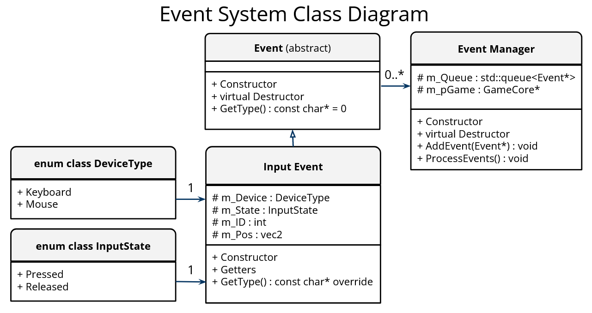

# Core Idea

To help decouple game logic, we need a way for objects to communicate with each other indirectly, rather than directly calling methods in other objects.

For example, if a collision system detected a bullet hitting an enemy, rather than calling a variety of methods immediately:

```c++
// This is just pseudo-code.

// Collision code:
if( pBullet->overlaps(pEnemy) )
{
	pEnemy->OnHit();
	pGame->Destroy( pBullet );
	pAudioManager->PlaySound( "Enemy_Hurt" );
}
```

we could send an event and decide what to do with it in a centralized location:

```c++
// This is just pseudo-code.

// Collision code:
if( pBullet->overlaps(pEnemy) )
{
	pEventManager->SendEvent( CollisionEvent(pBullet, pEnemy) )
}

// Enemy Code:
void Enemy::OnEvent()
{
	OnHit();
}

// Game Code:
void Game::OnEvent()
{
	RemoveObject( pBullet );
}

// Audio Code:
void AudioManager::OnEvent()
{
	PlaySound( "Enemy_Hurt" );
}
```

# Event Types

Events can be used for many different things
- Input
	- key down/up
	- mouse moved, mouse button down/up, etc...
- System events
	- window lost/gained focus
	- window closed, etc..
- Game events
	- Game started/ended
	- Explosions
	- Triggers, etc...

# Game Loop

With events, the following operations happen each frame:

- Process all system events
	- e.g. WM_KeyDown
- Process all game events
- Calculate time since last frame (delta time)
- Update objects by delta time
- Draw the scene
- optionally wait for v-sync

# Event Manager

Ideally, we want to control when and in which order events get processed

To achieve this, we can create an Event Manager

The Event Manager maintains a queue of events and all events in that queue will get sent to the game before the next Update()

Events and the Event Manager could also include timing information to allow events to be processed at a later time

# Lifetime of an Event

- Events objects will be created when needed and filled with relevant info
- The event will be sent to an Event Manager
- At the start of each frame, before Update is called the Event Manager will send all events to Event Handlers
- The game will process the event and when it's done, the Event Manager will destroy the event object (or recycle if you pool them)

# Framework vs. Game

We're going to create the Event Manager inside our Framework project

The reason for this is the Framework handles all system messages, like:
- key up/down
- mouse move
- mouse button up/down
- gamepad movement and buttons

So, we need to turn those messages into events that our game knows how to process

# The Event Class

The event class is small, no data is stored, instead we could add a virtual GetType() method that will return the correct type.

> **_NOTE:_** The virtual function, in effect, means the class is actually storing data, not as a member but as a pointer to the v-table that holds the GetType function pointer.

We could create an enum to store the different types, like this:

```c++
enum class EventType
{
	Input,
	WindowSizeChange,
};
```

But this is harder to extend when we add new types, so we'll use a string.

# Event Type

Using a string as a type has a drawback of needing to make sure the strings match up perfectly when you check the type, so instead we'll add a virtual method to the base event class and a static method to each event subclass, similar to our resource manager.

```c++
    static const char* GetStaticType() { return "InputEvent"; }
    virtual const char* GetType() override { return GetStaticType(); }  
```

This allows us to check the event type like this:

```c++
    if( pEvent->GetType() == InputEvent::GetStaticType() )  
    {  
        // pEvent is an InputEvent type, do stuff with it.  
    }
```

# Event Subclass for Input

Each event type will have it's own subclass with it's own custom member variables

For example, for an input event we'll want to pass along the following:
- Device Type (keyboard, mouse, joystick, etc…)
- State of the button/key (pressed, held, released)
- ID of the key or button pressed
- X/Y coordinates for the mouse/joystick/trigger

# Creating an Event

We want the Event Manager to queue up Events, so creating them on the stack won't do, they would go out of scope immediately after adding them to the queue, instead we'll create them on the heap.

With the Events and EventManager in place, creating an event could look something like this (in Framework.cpp):

```c++
case WM_KEYDOWN:
    InputEvent* pEvent = new InputEvent( DeviceType::Keyboard,
                                         InputState::Pressed, wParam );
    pFWCore->GetGame()->GetEventManager()->AddEvent( pEvent );
```

# The Event Handler

We put our Event Manager in our framework project, which needs a way to send events to our Game class

For that, we'll use our GameCore class, which is the interface class for our Game class.  This will allow the Framework project to talk to the Game project

We'll add a pure virtual method as follows:

```c++
    virtual void GameCore::OnEvent(Event* pEvent) = 0;
```

Then, an override method can then be added to the your Game class.

# Example Event Handling

```c++
void Game::OnEvent(Event* pEvent)
{
    if( pEvent->GetType() == InputEvent::GetStaticType() )
    {
        InputEvent* pInputEvent = static_cast<InputEvent*>( pEvent );

        if( pInputEvent->GetInputDeviceType() == fw::DeviceType::Keyboard )
        {
            if( pInputEvent->GetInputState() == fw::InputState::Pressed )
            {
                if( pInputEvent->GetID() == VK_DOWN )
                {
                    fw::OutputMessage( "Down arrow was pressed\n" );
                }
            }
        }
    }
}
```

# Other Event Types

The previous sections showed how to create events for windows input, but you'll want to create game specific events, such as:

- Player dying
- Enemy dying
- Explosions
- Level Ended
- Level Start
- etc...

# Event Manager Overview

The Event Manager will look something like this:

- It will contain a queue of event pointers
- The individual events should be allocated on the heap when an event is created (Object pooling can be used as an alternative, but allocating each event is fine for our purposes)
- At the start of the frame, before any other updating is done, the event manager will pass each event to the Game's OnEvent() method
- After the event is processed, the event will be removed from the queue and deleted



# Observer Pattern

We can also set up the EventManager to only send events to classes that are listening for them instead of sending all events to the Game class

For example, the Player class could register for input events, then it would be the only class to receive them

As another example, the Audio manager could register for collision events, so it would know to play a sound

There are a few approaches we can take to do this. Two of them are:
#### An inheritance/multiple-inheritence based approach

- A base interface class with a pure virtual onEvent that can be overridden
- This could be called EventListener
- Any class can inherit from EventListener as well as its usual parent
	- Its referred to as multiple inheritance if you inherit from multiple classes
- The EventManager class would store a list of EventListeners for each Event type
	- When processing events, send each event to each EventListener::OnEvent registered

#### A function pointer based approach

- See [Function Pointers](../C++%20Details/Function%20Pointers.md)
- The EventManager class would store a list of std::function objects for each Event type
	- When processing events, send each event to each function registered

# Reducing Memory Allocations

We're not worried about efficiency with this, so this isn't required, but worth being aware of.
#### Event Pooling

We can allocate an Event each time we need one, but small memory allocations are slow and can cause fragmentation.

Instead, ideally we'd want to pre-allocate a bunch of Events and take unused events out of the pool when we need one and return them to the pool after we've processed them.

#### Generic Events

If each Event is a subclass, we can't simply create a single pool of one class, so we could avoid subclasses for each event type.

We can do this by allowing each event to hold some pre-defined amount of data.  There are many ways to do this.

The simplest might be to give the Event object a fixed set of data, something like 2 void*, 2 ints and 2 floats for data.

Any Event passed around would have access to those 6 variables to store it's message, but those data types wouldn't have variable names custom to the event type.
