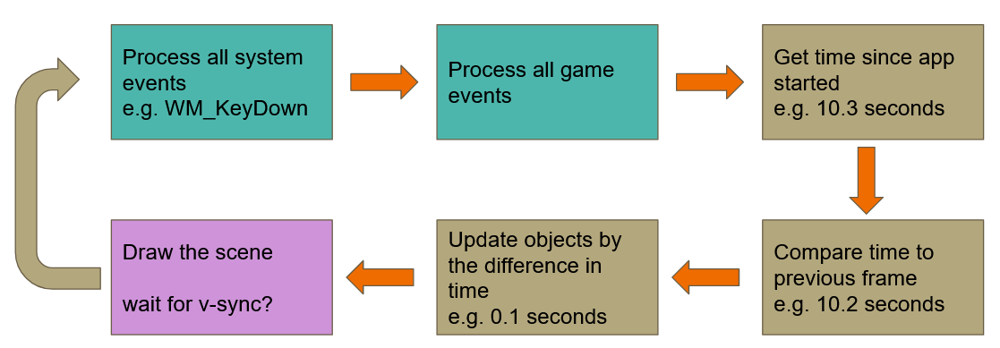
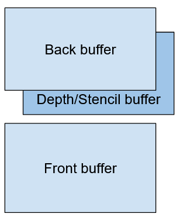
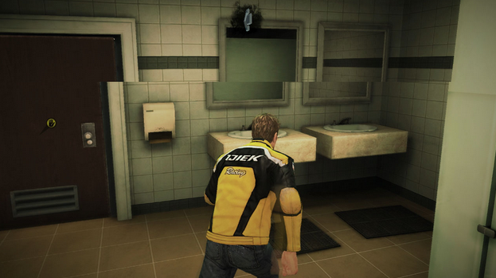
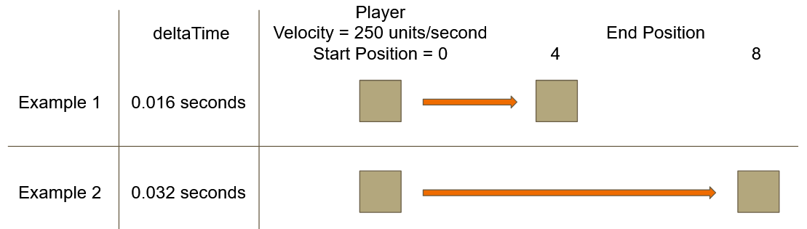
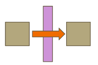

# Overview

The game loop generally consists of the following:
- Processing Input and Other Events
- Updating Objects
- Drawing Objects



# Rendering

#### Front and Back buffers
Generally, we have 2 buffers, a **front buffer** and a **back buffer**.
While our window is displaying the contents of one buffer (front), we draw into the other (back).
When we're done drawing, we tell Windows to swap the 2 buffers, so the back becomes the front and vice-versa
How often this happens is called our framerate



#### Framerate
Your framerate will not be stable. It can be affected by many things including:
- how complex the Update() is
	- lots of physics objects colliding
	- new assets loading
	- etc...
- how complex the Draw() is
	- more objects in the scene
	- more complex materials
	- more special effects needed (particles, explosions)
	- etc...

#### Screen Tearing
Tearing happens when you swap buffers before the monitor is finished showing the contents of the front buffer


#### V-Sync
We can avoid tearing by waiting for the monitor to completely finish drawing the front buffer before showing the contents of the back buffer.

Waiting for the monitor to finish presenting the framebuffer contents is called vertical syncing (V-Sync). The video driver can send a signal, called a v-blank, to let the application know it's finished displaying the image and your game can then swap the buffers and present the next image when it's ready.

With v-sync enabled, the framerate will be limited to the refresh rate of your monitor.

#### Refresh Rate
We start our game update after submitting the final rendered image to the system, so assuming a refresh rate of 60 hertz with v-sync enabled:

> We'll display 60 frames each second, which will get us a delta time of 1/60th second or 0.016666 seconds or 16 milliseconds to run our update, render the image and present it.

If your Update() and Draw() combined take longer than this, the game will wait for the next refresh and your next delta time will be 1/30th second.

#### Enabling v-sync in Windows
Enabling/disabled vertical sync is not handled by OpenGL, it's handled by the operating system, so it's a different mechanism for each platform you want to support, whether that's iOS, Android, Windows, OSX, Linux or any of the consoles.

For our case, there's a Windows specific function we'll use called:

```c++
bool wglSwapInterval(int interval)
```

The "interval" parameter refers to the number of v-blanks to wait for before showing the frame we've been rendering

i.e. with the interval set to 0, the video driver will display frames as quickly as we can produce them, which will most likely cause tearing. An interval of 1 will limit us to the refresh rate of the monitor.

# Delta Time

Because the framerate is unstable, we will use the change in time since the last frame (delta time) when taking into account object motion.

Delta time is often a float representing seconds since the last update.
Taking the time passed into account is as simple as multiplying.

```
m_Velocity * deltatime = change in position
```

So, with actual numbers:
```
250 * 0.016 = 4    <- the object moved 4 units since the last frame
```

```
250 * 0.032 = 8    <- the object moved 8 units since the last frame
```



#### Dangers of Large Timesteps
One danger of taking large steps is you might pass through another object.



This can be mitigated by limiting the delta time passed into Update() and calling Update() multiple times.
Of course, this has the side effect of requiring more processing and might slow your framerate further.
