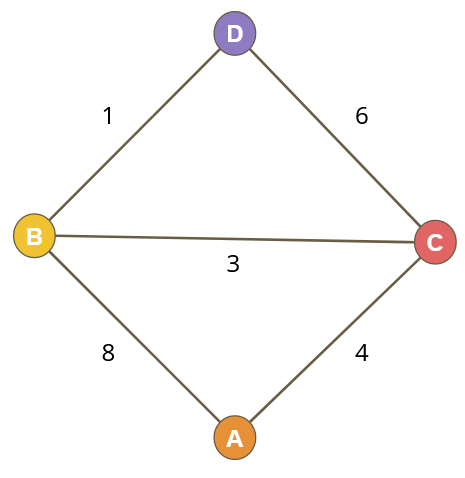
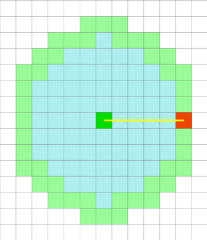
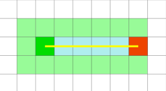
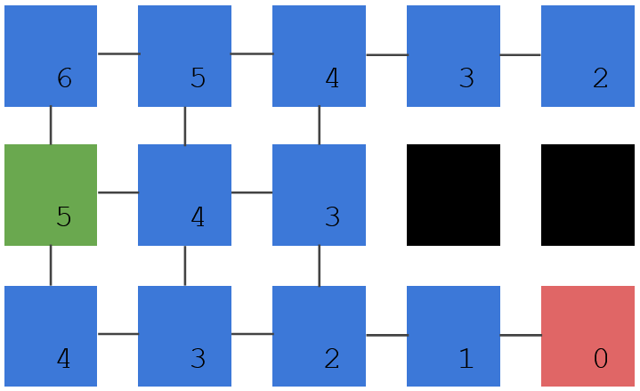

# A Simple Case



**Our goal**: find the lowest cost path from Node A to Node D
**Costs**: Traveling between nodes has a cost, each path can be different
Calculating this ourselves, the answer is:    **A -> C -> B -> D**

# Dijkstra's Algorithm

Dijkstra's algorithm is a series of steps you can follow that will find the lowest cost path through a graph of nodes. Assuming no nodes have negative costs.

#### Algorithm

We travel from the start node, giving each node some values along the way

The value we give represents the total cost of travelling to that node. We call this cost ‘G’

- Give the start node a score of 0
- Repeat the following
	- Pick the node with the lowest G
		- Stop here if this node is our target
	- Travel to all of its neighbours giving them a ‘G’ score
		- the new ‘G’ is the current node’s ‘G’ plus the cost to travel to the new node
			- if we check a node twice, we keep the lower ‘G’ score

#### Step by Step Example

[Pathfinding - Step by Step](Pathfinding%20-%20Step%20by%20Step.md)

# A* Algorithm

##### Pathfinding Visualizer
https://qiao.github.io/PathFinding.js/visual/

The A* (A Star) algorithm is a small improvement over Dijkstra's. The improvement comes from guessing about a direction and checking nodes in the "right" direction before checking nodes in the "wrong" direction.

Unlike Dijkstra's algorithm, A* doesn't guarantee finding the shortest path. It will in most cases, but if the heuristic generates estimates greater than the actual cost to travel between nodes, it may miss the shortest possible option. This won't be a problem on grids or in cases where cost is based on distance. One potentially broken case would be one where the estimate is based on distance, but certain nodes are connected via higher speed travel, like moving sidewalks.

**Dijkstra Search**


**A* Search**


#### A* Change

The main change comes from this guess at a direction, which is commonly referred to as a heuristic. This heuristic is there to help decide which node to check next. It's just an estimate and must be able to be calculated quickly.

*From wikipedia: “a heuristic, is any approach to problem solving, learning, or discovery that employs a practical method not guaranteed to be optimal or perfect, but sufficient for the immediate goals.”*

Terms:
**G**: Lowest cost found to reach a node
**H**: Estimate of the cost to get a node to the target
**F**: G+H: Used in place of G Dijkstra's algorithm to decide which node to check next

One common heuristic is the **Manhattan distance** to the target. Manhattan distance simply refers to the number of ‘blocks’ away something is ignoring obstacles

Here's an example, every node shows the estimate of how far away it is from the target. This *heuristic* must be fast to calculate, so it doesn't take into account blocked nodes



# Implementation Details

#### Path Nodes

- A PathNode is not a tile in our tilemap
	- but we need an array of PathNodes the same size as the tilemap
- Each PathNode:
	- keeps track of the ‘F/G/H’ scores
	- keeps track of its Parent Node (The node we came from)
		- When we reach the destination node, we use the parent nodes to determine the shortest path back to the starting node
	- A status enum of Unchecked, Open, Closed

#### Open List

- A list of all PathNodes that are actively being considered
- The next node we consider will have the lowest 'F' score in the Open List

There are many ways to implement this:
- We can keep the list sorted at all times, the lowest score at the front
- We can keep it unsorted and search through the list for the lowest
- We can avoid a list altogether and search through all PathNodes for "Open" nodes
- If you want a good option, look up the priority queue data structure

#### Closed Nodes

- We need to track PathNodes that have already been considered
- Once a Node is "closed" it can’t be put back in the Open List
- This is marked with the status enum of our PathNode

#### Algorithm

- Place the Path Node referencing the start node in the Open List
- Repeat the following steps until done:
	- Remove the node with the lowest 'F' score from the Open List
	- If this node is the destination, we’re done
	- Otherwise, mark that node as closed
	- Then, for each adjacent node (if walkable and not already in Closed list):
		- Calculate their ‘F’, ‘G’ and ‘H’ score
			- G will equal the current node G + the cost of travel to this new node
			- H will be manhatten distance (or other heuristic)
		- If this new node already has a ‘G’ score
			- Then we had previously found a way here
			- Ignore this neighbour if the old way to get there was lower
				- i.e. old G < new G
		- Set this node to be the adjacent node’s parent
		- Add the node to the Open List

#### The End

- If we found the destination during the previous steps:
	- Create a list of nodes starting with the destination and stepping through all the parent nodes until we reach the start
- Otherwise, if we run out of Nodes in the Open List, then no path was found
	- Return a fail condition
	- If desired, return a path to the nearest Node to destination

# Pseudo-code

```c++
// Reset all nodes (parents to -1, all 3 costs to FLT_MAX and status to unchecked)
// Get the starting tile index and the destination tile index
// Set starting node cost to zero, mark it open, and add it to the open list

// Keep looping until the open list is empty
{
	// Find the node with the lowest 'F' score from open list, make it the current node
	// Remove the node from the open list
	// Check if the node is the destination, if so return true (found a path)
	// Mark the node as closed

	// Build a list of valid neighbours. Skip nodes that are closed or not walkable.
	// Loop through the neighbours
	{
		// If it isn't already in the open list, add it
		// Calculate 'G' for this neighbour tile
		//     newG = G of current tile + cost (which is likely a 1)

		// If the new 'G' is less than the old 'G' of this neighbour
		{
			// Set the parent of the neighbour to the current tile
			// Calculate and/or set the 'F', 'G' and 'H' scores
		}
	}
}

// Since no nodes are in open list, return false (no path found)
```
