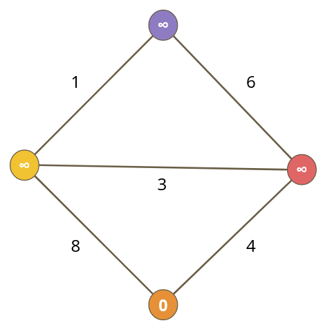
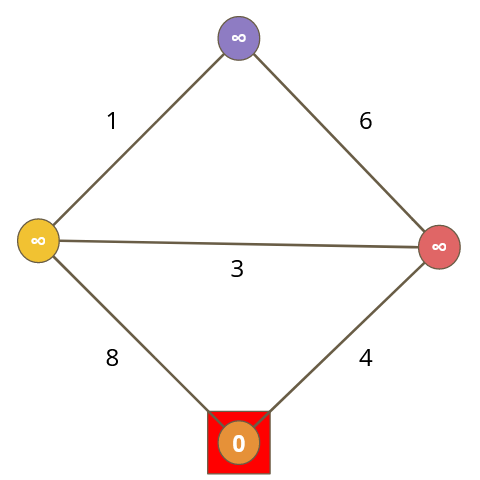
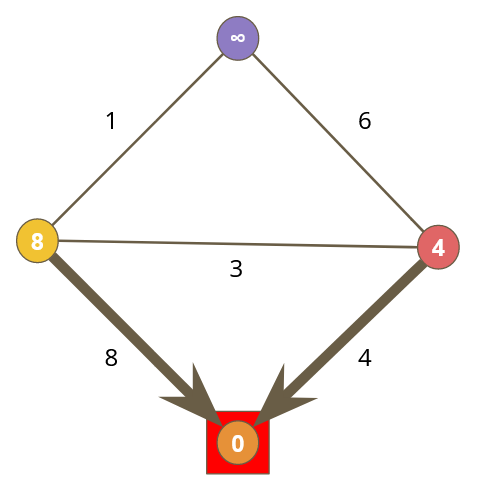
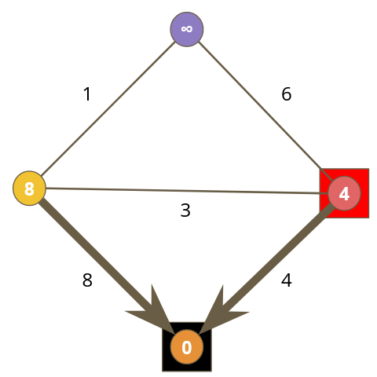
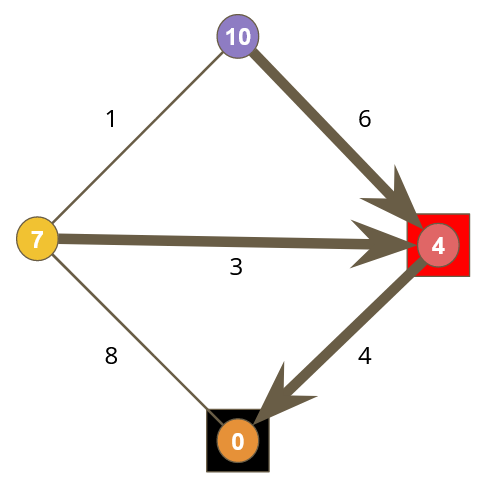
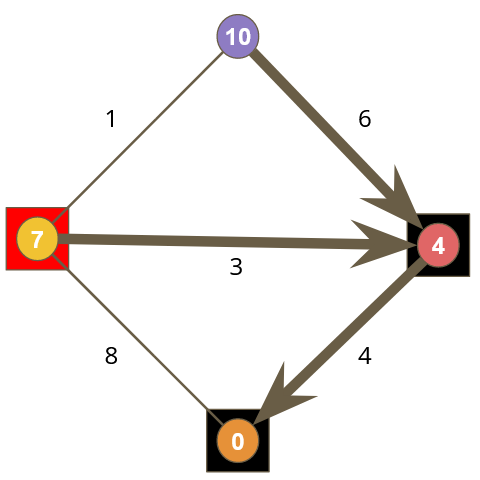
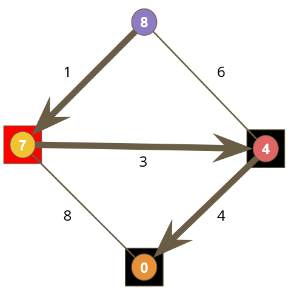
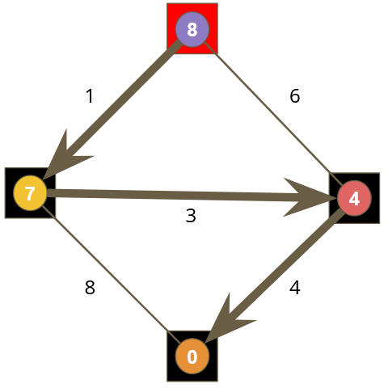

# Step by Step example of Dijkstra's Algorithm

#### Step 1

- Give all nodes a cost of infinite
- Give the start node a cost of 0
	- i.e. Change orange: ∞ → 0

#### Step 2

- Pick the node with the lowest G
	- In this case: Orange

#### Step 3

- Calculate the neighbour G scores
	- Yellow: ∞ → 8
	- Red:    ∞ → 4
- Make neighbours point back to the active node

#### Step 4

- Pick the node with the lowest G
	- In this case: Red

#### Step 5

- Calculate the neighbour G scores
	- Yellow: 8 → 7  
	- Blue:   ∞ → 10
- Notice the arrow from yellow is now pointing to red
- Also notice we overwrite the score in yellow because the new 'G' score is lower
	- i.e. we found a better path to yellow

#### Step 6

- Pick the node with the lowest G
	- In this case: Yellow

#### Step 7

- Calculate the neighbour G scores
	- Blue:  10 → 8
	- Notice the arrow from blue is now pointing to yellow

#### Step 8

- Pick the node with the lowest G
	- In this case: Blue
- Since Blue is the target, we're done
- Follow the arrows back home.
- Blue → Yellow → Red → Orange

