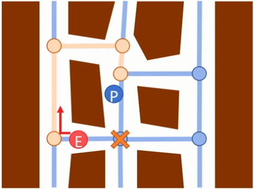

# Map information

A game can hold onto map information in multiple ways, including:
- A list of all of the static meshes that make up the environment
- A structure that holds all the pathfinding information
	- see [Pathfinding - A-Star](Pathfinding%20-%20A-Star.md)
	- This will mainly be a set of nodes and edges connecting the nodes
- You might end up with different maps for different characters
	- For example, Monster Hunter Rise has maps for large monsters, small monsters and palicos

# Agent

Beyond finding a path, we need our AI to work it's way from its current location to the next point along it's path. In this logic, the object being moved is often referred to as an Agent.

The agent code might differ greatly depending on what kind of movement it is capable of. For example, if the agent is a car, then it might be able to turn left, turn right, accelerate and slow down. If it's a human, it might be able to turn left/right, move forward, climb, drop down a ledge, climb a ladder, avoid other moving objects, etc.

#### A Simple Agent

We're going to deal with a very simple case, not worrying about anything dynamic, and letting enemies pass through other enemies.

Once a path is found, the agent needs to follow that path to make its way to the destination.

There are many ways to accomplish this, but we'll try to keep it as similar to the player controls as possible.

Add the following to your Enemy class (for example):
- Keep a list of points to follow
- Give the agent a member `vec2 m_MovementControls;`

Then, every frame:
- If the agent is near the next point in the list, remove it from the list
- Set the movement controls to point towards the next point in the list
- Move the agent based on the movement controls, its speed and deltaTime

Once the point list is empty, we're at our destination, so idle for a bit then pick a new destination and ask the map for a path.

# Considerations

#### Multi-agent Systems

How do we deal with many AIs running around?
Do we want them to all take the same path or to try to flank the player?

These are generally problems we solve at a higher level than pathfinding/navigation. The core routines described above can still be used as is in a lot of cases, but sometimes small tweaks are nice

- Options
	- Don't track the player, track points near the player, make those points relative to the location of the enemy
		- For example, treat the player as a circle with a larger radius, pick a point nearest the enemy on that circle and path-find to that point
	- To make an agent flank the player, it doesn't want the shortest route possible, it wants a more round-about route
		- A solution from RE4
			- They create specific flanker units with different behaviour
			- 
			- The player marks nodes as it passes through them, presumably with a timestamp or a counter
			- When pathing, an enemy agent will consider nodes blocked if:
				- The timestamp is recent
				- The counter is within some range of the current counter value
