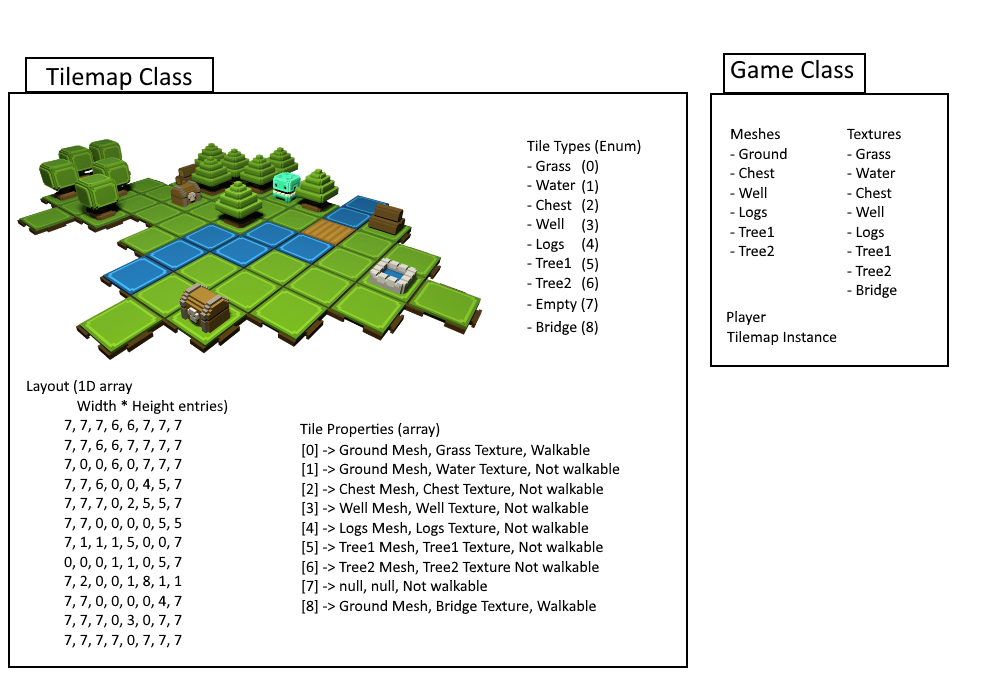

# Categories

There are a different kinds of tile based games, including:

- Everything is restricted to tiles
	- The player and enemies move from tile to tile


- The world is restricted to tiles
	- The player and enemies move around freely


# Tilemaps

Tiles are stored in an array referred to as a tilemap.

#### Choices

**Data Type**
This array should be as compact as your game allows. Using unsigned chars for each element would allow us to store up to 256 tile types, which is often enough for simple games, but can be quite limiting as the game grows in complexity. For reference, here are some data type limits:

- Unsigned char: 8-bit: 256 possible values
- Unsigned short: 16-bit: 65,536 possible values
- Unsigned int: 32-bit: 4,294,967,296 possible values

**1D, 2D or 3D**
We can choose to store the tile info in a 1D array, a 2D array, or a 3D array. This decision is greatly impacted by the choice of making the array static or dynamic.

Using static sized arrays makes it easy for the compiler to do the math for you if you use 2D or 3D arrays. If you dynamically allocate the arrays, a 1D array is more convenient and the math isn't very complicated.

**Static or Dynamic**
We need to choose whether to allocate statically, which would limit the size of the tilemap, or allocate dynamically, which would allow for virtually unlimited size.

Code to statically allocate a 2D array:
```c++
	const int width = 10;
	const int height = 5;

	// Create the array.
	unsigned char tiles[height][width];

	// Access a single tile.
	tiles[2][5]; // 2 up, 5 over.
```

Code to dynamically allocate a 1D array: **IMO, best option**
```c++
	int width = 10;
	int height = 5;

	// Allocate 1D array.
	unsigned char* pTiles = new unsigned char[height*width];

	// Access a single tile.
	pTiles[2*width + 5] = 1; // 2 up, 5 over.
```

Code to dynamically allocate a 2D array:
```c++
	int width = 10;
	int height = 5;

	// Allocate a 2D array:	
	unsigned char** ppTiles = new unsigned char*[height];  
	for( int i=0; i<height; i++ )  
	ppTiles[i] = new unsigned char[width];

	// Access a single tile.	
	ppTiles[2][5] = 1; // 2 up, 5 over.
```

First static array and dynamic 1D array would both be stored in a single block of contiguous memory, where the dynamic 2D array wouldn't be, each row might end up in a completely different block of ram.

I recommend dynamic 1D arrays, it's a small tradeoff for flexibility vs extra math, but the math operations are quite simple and can be buried in the tilemap class.

# Converting 1D to 2D


Convert from 2D to 1D:
```
	int index = y*width + x;
```

Convert from 1D to 2D:
```
	int x = index % width;
	int y = index / width; <- ints will be truncated
```

##### This can be extended to 3 dimensions, essentially layers of tilemaps.

Convert from 3D to 1D:
```
	int index = z*width*height + y*width + x;
```

Convert from 1D to 3D:
```
int x = index % width;  
int y = (index % width*height) / width; <- ints will be truncated  
int z = index / width*height;           <- ints will be truncated
```

# Implementation Overview

- Tile type enum
- Layout
- Tile properties array



## Layout / Tilemap Storage


No matter which option you choose to store the data, the actual tilemap data will need to be defined somewhere, either on disk or in c++.

If stored in c++, it the zelda dungeon above can be stored like this:
```
unsigned char layout[] =  
{
  2, 2, 2, 2, 2, 2, 2, 2, 2, 2, 2, 2, 2, 2,  
  2, 1, 1, 1, 1, 1, 1, 1, 1, 1, 1, 1, 1, 2,  
  2, 1, 3, 3, 3, 1, 1, 1, 1, 3, 3, 3, 1, 2,  
  2, 1, 3, 1, 1, 1, 1, 1, 1, 1, 1, 3, 1, 2,  
  4, 1, 3, 1, 3, 3, 3, 3, 3, 3, 1, 3, 1, 2,  
  2, 1, 3, 1, 1, 1, 1, 1, 1, 1, 1, 3, 1, 2,  
  2, 1, 3, 3, 3, 1, 1, 1, 1, 3, 3, 3, 1, 2,  
  2, 1, 1, 1, 1, 1, 1, 1, 1, 1, 1, 1, 1, 2,  
  2, 2, 2, 2, 2, 2, 4, 4, 2, 2, 2, 2, 2, 2,  
}
```

## Tile Properties

Tiles will have other properties associated with them. For example:
- Logical properties
	- Can it be walked on
	- Can you fly over it
	- Can you swim through it
- Visual properties
	- Which mesh does it use
	- Which shader does it use
	- Which texture does it use
	- Is it damaged

##### Terrible Idea: Each tile as it's own object.
Rather than using an unsigned char for each tile, we could use a structure:
```c++
	// Again: This is a terrible idea, don't do it. 
	struct Tile
	{
		unsigned char m_Type;
		Mesh* m_pSprite;
		bool m_Walkable;
		int m_Damaged;
	}
	m_pTilemap = new Tile[width*height];
```

This may work for small tilemaps, but a lot of data ends up being duplicated, making it use up a lot more ram, and makes it harder to manage and find bugs. For example, it would be possible for all walls to block you, but one has it's "walkable" bool set to true by mistake.

##### Better Idea: Shared properties

Instead, we'll create a table that stores properties for each tile type.

```c++
	struct TileProperties
	{
		Mesh* m_pSprite;
		Texture* m_pTexture;
		bool m_Walkable;
	}
```  

Each tile type will share properties, for example all ground is walkable, while all water and walls are not walkable.

```c++
	m_TileProperties = new TileProperties[(int)TileType::NumTypes];
```

We need to define all of our tile types, we'll use an enum for this. We can use last enum entry to set our array size. For example:  

```c++
	enum class TileType
	{
		Grass,     // 0
		Water,     // 1
		Wall,      // 2
		NumTypes,  // 3
	};
```

Since the TileType enum is *scoped*, we can't use it's values as numbers directly, so we need to typecast to int when we want to use them.

```c++
	m_pLayout = new TileTypes[mapWidth * mapHeight];
	m_pTileProperties = new TileProperties[(int)TileType::NumTypes];
```

# Tile Space vs. World Space

In order to render a tile to screen, it needs a world position

To create one, we need to define a scale for our tiles

This is completely arbitrary, for example:
	1 tile = 5x5 world units

This would mean the player would have to move 5 units to walk from the center of one tile to the center of the next tile

we need to simply multiply our tile x and y values by these sizes:
```
	world x = tile x * 5  
	world y = tile y * 5
```


##### Tile -> World

Knowing which tile a world point lands on is also important.
Using tile size: 1 tile = 5x5 world units

We can do the following:
```
	tile x = world x / 5  
	tile y = world y / 5
```

For Example:
```
	Player World Pos: (12.54, 24.2)
	Player Tile: (12.54 / 5, 24.2 / 5)
	Player Tile: (2, 4)
	The fractions are truncated
```

# Easy Collision Detection

One simple way to check for collisions with tiles is to simply check the four corners of an object to see if they land on a non-empty tile

So, in pseudo-code:
- For each red point displayed
	- Calculate the world space position for that point
	- Get the tiletype at that position
	- If the tile properties for that tiletype isn't "walkable", a collision occurred


This check can be done after calculating the destination position but before moving the object.

If a collision occurs, don't assign the new position to the player.

We may still want to slide off the tiles, we can do this by checking each axis of movement separately.

i.e. Check if moving along the x-axis would create a collision, if not, move the player. Then do the same for the y-axis.

# Odds and Ends

#### Custom Tiles

For a property like "how damaged is the tile", we have a couple of options:
- Define separate tile types for each state
- Don't store "damageable" tiles in the tile map, make them regular game objects

This can be the case for many other tile types, such as open/closed doors, etc...

#### Other Game Objects

Many game objects, including the player, may not be assigned to tiles.

Also, some tiles may need custom data or custom rendering, so it might be worth creating a game object to store that data or provide a way to do custom Update or Render calls.

#### Other

###### Auto Detect Neighbouring Tiles

In this example, we only have 2 tiles types


```c++
	unsigned char tiles[] =
	{
	  1, 1, 1, 1, 1, 1, 1,
	  1, 2, 2, 1, 1, 1, 1,        1 = Grass
	  1, 2, 2, 2, 2, 1, 1,        2 = Water
	  1, 2, 2, 2, 2, 2, 1,
	  1, 2, 2, 2, 1, 1, 1,
	}
```

By checking a water tile's neighbours, we can determine which sprite to use
This would require 48 different water sprites to cover every combination

# Exercise

[Exercise - Tilemap](../Exercises/Exercise%20-%20Tilemap.md)
