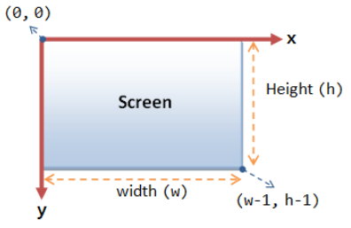
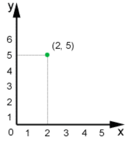
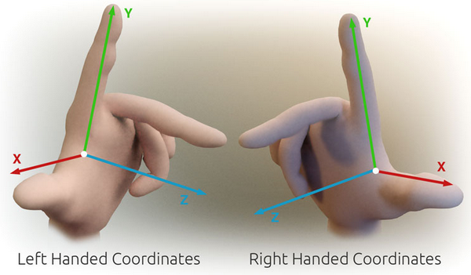

See [Spaces - Coordinate Systems](Spaces%20-%20Coordinate%20Systems.md)

# 2D Coordinate Systems

In 2D we've dealt with 2 coordinate systems:

0,0 at Top Left:

0,0 at Bottom Left:

# 3D Coordinate Systems

In 3D we have a lot more choices. There are many potential ways to select coordinates for 3D space.  

DirectX and OpenGL are commonly considered Left-handed or Right-handed respectively, but can be either.

# Handedness - Left vs. Right

We're going to use a left-handed system with Y for up.

