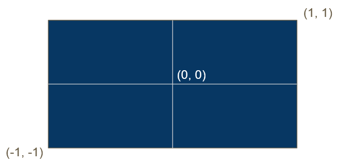

This coordinate system defines what will appear on screen
In order to appear on the screen, primitive positions must cross into this range of values when output by the vertex shader

A coordinate system that defines what will appear on screen.
In order to appear on the screen, primitive positions must cross into this range of values when output by the [Vertex Shader](Vertex%20Shader.md).

