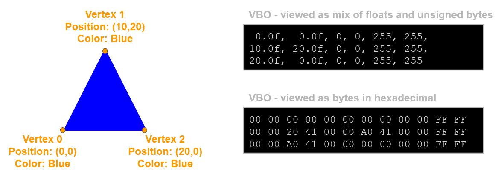
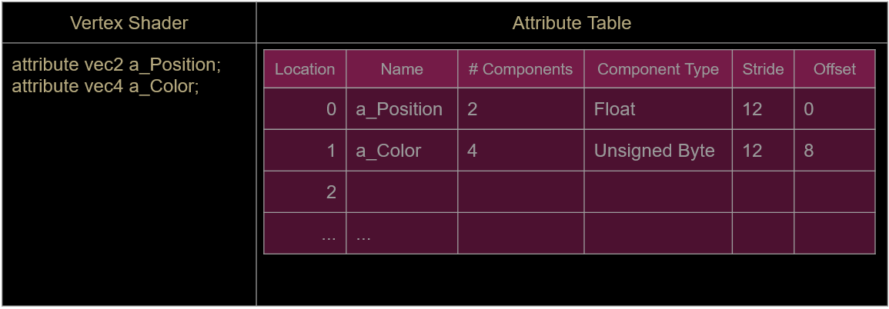

# Mixing Data Types

Rather than making an array of floats for our vertex attributes, we'll create a struct to contain more than one type
```
struct VertexFormat
{
	float x, y;
	unsigned char r, g, b, a;
};
```
We can then make an array of VertexFormats.

# Functions in Structs

Structs, like classes, support functions and constructors

```
struct VertexFormat
{
	float x, y;
	unsigned char r, g, b, a;
	
	VertexFormat( float nx, float ny, float nr, etc )
				: x(nx), y(ny), r(nr), etc
}
```

A constructor like this will make is easier to initialize our array of attributes

# 2 Attributes In GLSL

Our existing shader has a single attribute for position:
	`attribute vec2 a_Position;`
We need to add an extra attribute for color:
	`attribute vec4 a_Color;`
Notice we're declaring a vec4 in the shader, which is 4 floats, but our VertexFormat structure stores color as 4 unsigned chars
We will need to normalize (put the colors in 0-1 space) when sending them to the shader (set the 4th param of glVertexAttribPointer to GL_TRUE)

# Triangle With Color



### Attribute Table

From C++, we now need to set 2 lines of the attribute table



# Exercises

- Setup keyboard input to move a shape around using a vec2 uniform
- Use built-in sin and cos functions to rotate your shape
	- start with a hard-coded angle, then pass the angle in as a uniform
- Pass time in as a uniform float
	- use it as an additional offset, scale or rotation.
- Play with sin(time) as a value rather than just time
