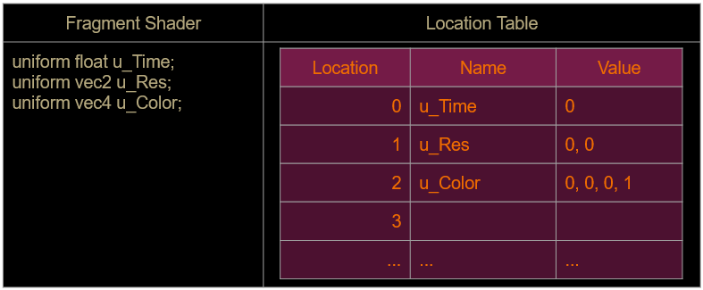
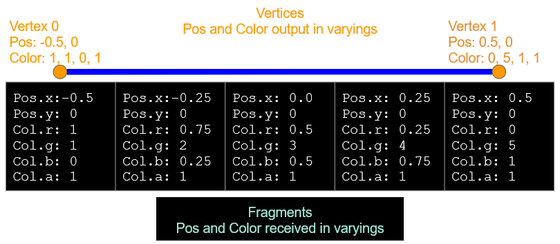

# Fragment Shader Basics

The fragment shader is *responsible for calculating the final color* of each pixel drawn.

- **gl_FragColor** must be set with the color of choice
- Gets executed once for every pixel drawn
- The same fragment shader code gets executed for all pixels being drawn
- Textures can be sampled by the fragment shader

# Fragment Shader Inputs

- **Built-ins**:
	- gl_FragCoord
- **Uniforms**: user defined, commonly:
	- Time
	- Resolution
	- Textures
	- Colors
	- etc…
- **Varyings**: user defined values output from the vertex shader
	- Vertex positions
	- Normals
	- etc…

# Uniforms

- “Constant” values that are set by the user
- These will be the same for every fragment drawn
- Can be altered in C++ between draw calls
- Cannot be set or modified while the shader program is running
- See [Uniforms](Uniforms.md)

# Uniform location table

All uniforms declared are stored in a table by OpenGL.


# Programming a Uniform

In the fragment shader file (GLSL):
- Define the uniform
	- `uniform float u_Time;`

In your game code **after the shader has been activated** (C++):
- Get the uniform location/index
	- `GLint timeLoc = glGetUniformLocation( programHandle, “u_Time” );`
- Set the value for the uniform
	- `glUniform1f( timeLoc, 3 );`

**Make sure you call the correct function for the uniform data type:**
- Program *float* types with *glUniform1f*
- Program *vec2* types with *glUniform2f*
- and so on...

# Sample Shader Program

```glsl
uniform float u_Time;
uniform vec4 u_Color;
uniform vec2 u_Resolution;

void main()
{
	vec4 color = u_Color;
	
	color.r = u_Time;
	color.g = gl_FragCoord.x;
	color.g /= u_Resolution.x;

	gl_FragColor = color;
}
```

# Program Flow Example

```c++
// Start using this shader program
glUseProgram( programHandle );

// Setup the shader’s uniform and draw a solid white triangle
glUniform4f( colorLocation, 1, 1, 1, 1 );
glDrawArrays( GL_TRIANGLES, 0, 3 );

// Set the uniform again and draw a semi-transparent red triangle on top of it
glUniform4f( colorLocation, 1, 0, 0, 0.5f );
glDrawArrays( GL_TRIANGLES, 0, 3 );
```

# gl_FragCoord

From the docs: "contains the window-relative coordinates of the current fragment"

gl_FragCoord is a built-in variable that contains information, it's not something you set.

When shading a fragment, gl_FragCoord contains the pixel offset from the lower left.

For example:
- when the bottom left pixel's fragment shader is running, it holds (0, 0)
- when the top right pixel's fragment shader is running, it holds (1280, 720)
	- assuming that's your window resolution

# Varyings

- These variables are given a value in the vertex shader
- The values stored are then interpolated linearly between each fragment
- The interpolated values arrive as inputs to the fragment shader
- Each component of a varying is interpolated between the values of the other vertices that make up it’s primitive

# Sample shader

Varyings must be declared with the same name in each shader

Vertex Shader:
```
attribute vec2 a_Position;
varying vec2 v_ObjectSpacePosition;

void main()
{
	gl_Position = a_Position;
	v_ObjectSpacePosition = a_Position;
}
```

Fragment Shader:
```
varying vec2 v_ObjectSpacePosition;

void main()
{
	vec4 color = vec4(0,0,0,1);
	color.r = v_ObjectSpacePosition.x;
	gl_FragColor = color;
}
```

# Interpolation of Values

Example of interpolating values for a line that gets rasterized into 5 fragments



# glViewport

In C++, glViewport is used to specify which part of the window you want to draw to:

```c++
glViewport( x, y, width, height ) // x and y are for the bottom left of the area
```

For example:
- To draw into the top left corner of  a 1280x720 window, make this call:
	- `glViewport( 0, 360, 640, 360 )`

# Debugging Shaders

You can't add breakpoints to shaders

You can't printf variable values to the output window

You can set the color of a fragment to represent a variable's value

To do this:
- First multiply/divide your value to fit it in a 0-1 range
- Set gl_FragColor to that value, set just one color if debugging a float, or set all 3 if debugging a vector

# Exercises

- "Debug" the gl_FragCoord value in your fragment shader
	- remember, gl_FragCoord's value is in pixels, so you'll need to make the values smaller to fit it into the 0-1 range gl_FragColor is expecting
- See [Exercise - Fragment Shaders](../Exercises/Exercise%20-%20Fragment%20Shaders.md)
