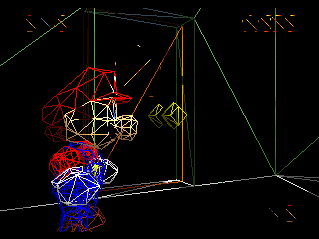
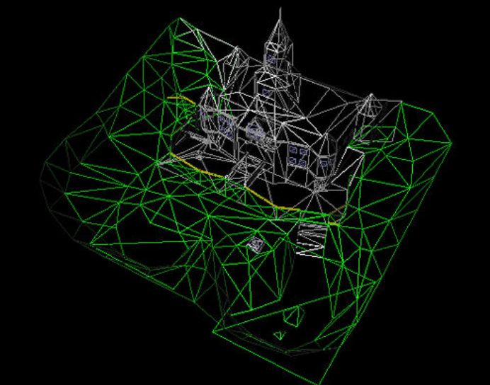
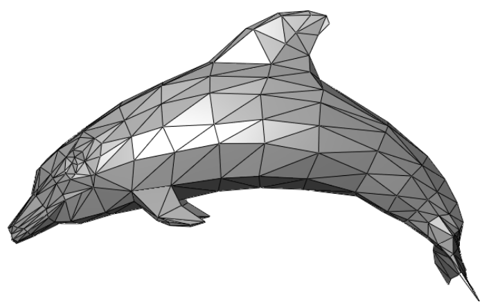
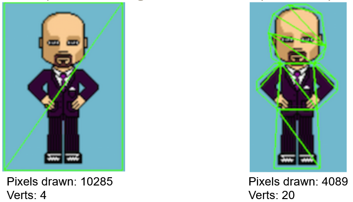
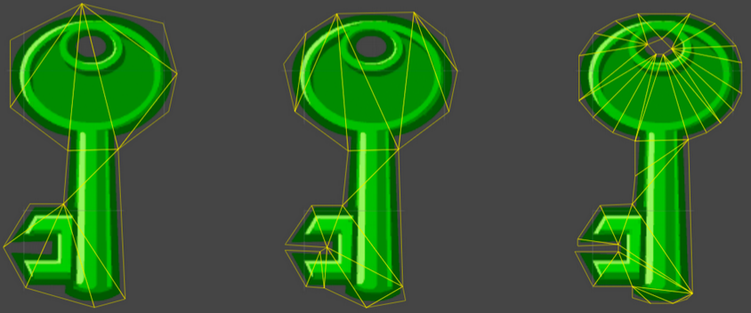
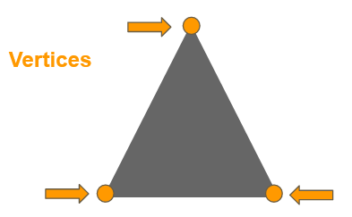
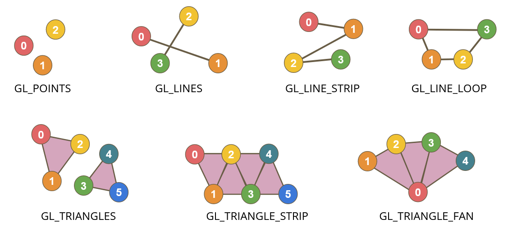

# Meshes

Most modern games are made of triangles.
Video cards are optimized for processing triangles.
A collection of triangles is called a mesh.

#### 2D Games
Even 2D games are built out of triangles

In 2D, we can make simple boxes out of 2 triangles, or custom fit the sprite to fit on a series of triangles. Generally the 2nd option is better since a lot less pixels will need to be processed. There's a cost to dealing with pixels, even if the pixel is fully transparent.

How much we optimize is up to the user or the tools that are used to generate these tighter fitting meshes.

# Vertices

Each point in a mesh is called a *vertex*. Triangles are made of sets of 3 *vertices* each.

# Primitives

OpenGL and other graphic languages aren't limited to triangles, there are 3 core primitive types available with some additional variations  

Primitive Types
- Points    
- Lines, Line strips, Line loops    
- Triangles, Triangle strips, Triangle fans

You'll also see Quads and Polygons in the code, but those are [Deprecated](Deprecated) and shouldn't be used.

The order of the vertices is critical, as well as how many points you need to specify before a shape appears.

For example:
If you want to draw triangles, you would specify GL_TRIANGLES and ever 3 points you provide would make a new triangle. If you have less than 3, nothing will appear.
If you say GL_TRIANGLE_FAN, the first 3 vertices will make a triangle and the 4th point will reuse points 0 and 2 to make a 2nd triangle.

# Implementation Details

[Vertex Attributes and VBOs](Vertex%20Attributes%20and%20VBOs.md)
