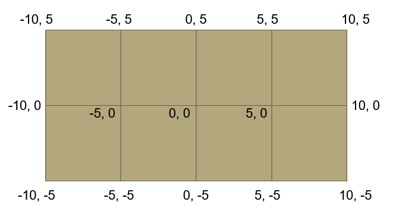
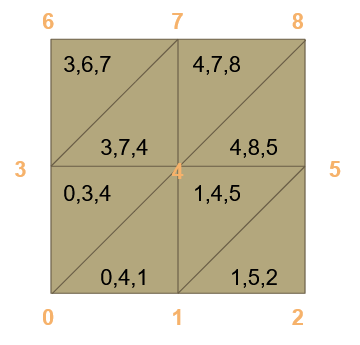
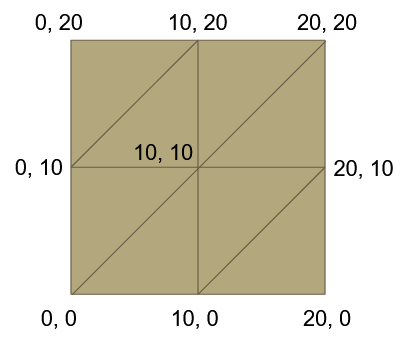

# Vertices

Using the following as input:
```
Vertex count: (5, 3)  
World Size: (20, 10)  
Offset: (-10, -5)  
Total Verts: 15
```

We'd want to create the following mesh:


To do this, we'd want to first calculate the size of each "step" between the vertices:
This can be calculated as follows:
```
World size X = 20
Vertex count X = 5

Step size X = 20/(5-1) = 5 world units.
```
The same for the Y axis.

Now with the 2 step sizes, we can plot all the points:
```c++
for( y=0; y<3; y++ )
{
	for( x=0; x<5; x++ )
	{
		vec2 pos = vec2( x*stepX, y*stepY );
	}
}
```

# Indices

To plot the indices, we work with the boxes rather than the vertex counts.

i.e, if there are 3x3 vertices, we have 2x2 boxes:


We can work out the indices for the 2 triangles in each box

For the box at the lower left, we have the following indices:
```
0,3,4, 0,4,1
```

When moving to a box to the right, we add 1 to each index
When moving to a box above, we add 3 (or the X vertex count) to each index

This allows us to generalize the approach.

First calculate the bottom left vertex:
```c++
// Every X increases the index by 1
// Every Y increases the index by vertexCount.x
int bottomLeftIndex = y*vertexCount.x + x;
```

Then plot the indices:
```c++
for( y=0; y<2; y++ )
{
	for( x=0; x<2; x++ )
	{
		int bottomLeftIndex = y*vertexCount.x + x;
		
		indices.push_back( bottomLeftIndex + 0 )
		indices.push_back( bottomLeftIndex + vertexCount.x )
		indices.push_back( bottomLeftIndex + vertexCount.x+1 )

		indices.push_back( bottomLeftIndex + 0 )
		indices.push_back( bottomLeftIndex + vertexCount.x+1 )
		indices.push_back( bottomLeftIndex + 1 )
	}
}
```

# UVs

UVs work the same way as the vertex positions, just consider how often you want the texture to repeat and calculate the "step" for the u and v


