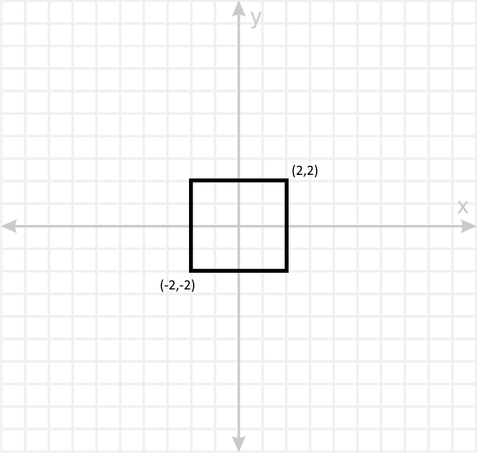
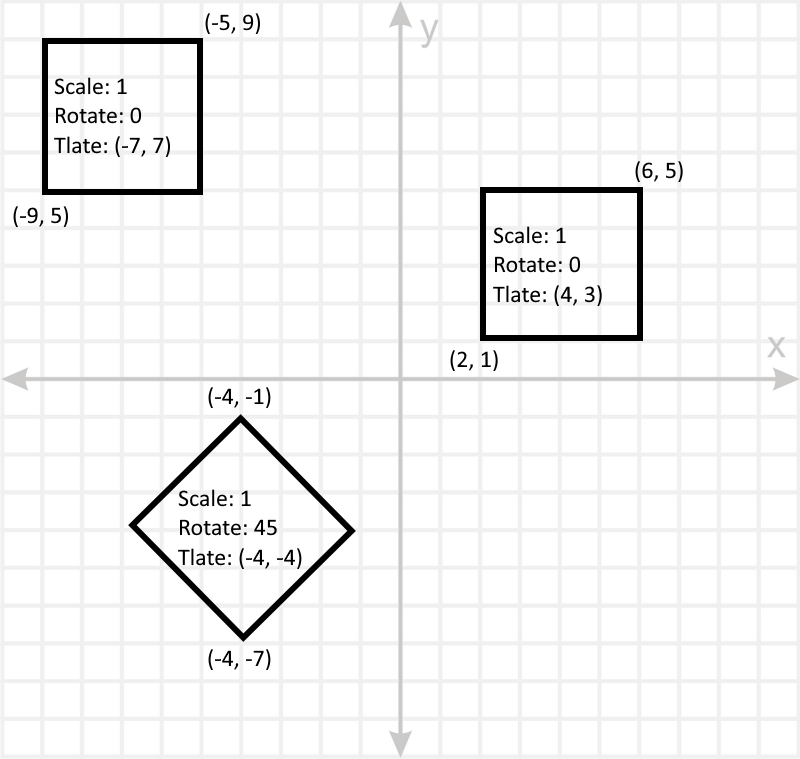
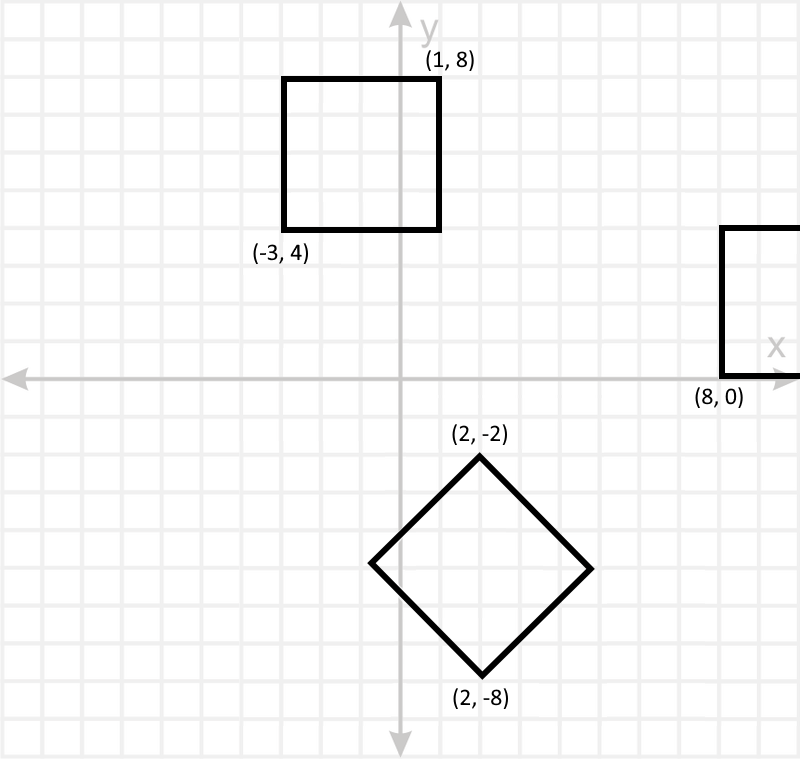
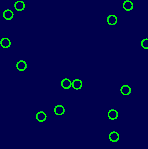
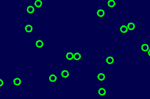

In computer graphics we often work in 4 different *coordinate systems* that we refer to *spaces*. These are arbitrary but used everywhere to match up with the way we think about the world.

The 4 spaces are:

- **Object Space** (aka Local Space, aka Model Space)
	- The space where the object is defined
- **World Space**
	- The space where the object is in the world. Relative to other objects
- **View Space**
	- The space where the object is in relation to the camera
- **Clip Space**
	- The space where the object is in relation to the viewport

# Object Space

This space is infinitely large and used to define the positions of vertices, centered around a 0,0 point, which indicates the pivot of the object.

By centering the object around 0,0, we can scale, rotate and translate these points to put them anywhere in the world



# World Space

World space indicates where objects are relative to each other.

Each object can be transformed from Object Space to World Space by scaling, rotating and translating each of its vertices.

The (0,0) point is technically the center of the world, but it's rarely relevant since worlds aren't often transformed.

For example, with 3 objects, each with their own Scale, Rotation and Translation values, this is what our world would look like:



# View Space

This space contains the same relative coordinates for individual objects as world space with the exception that the entire world is centered around the camera.

For example, if the camera was at (-6, 1), this is what view space would look like:



# Clip Space

To make a portion of view space visible on the screen, we simply need to scale the coordinates to make what we want visible land in the -1 to 1 range of clip space.

In this example, we want to display a 20x20 region of the world, centered on the camera, so we simply multiple all coordinates by 0.1.


# The Example Above in Code

All of this coodinate system manipulation happens in the vertex shader.

Each vertex being processed by the vertex shader starts with an attribute for its position. This position comes from the VBO, which is stored inside our mesh.

The object in this example is placed at (5,8) in the world and has a scale of (2,4).
To match the above examples, the camera is at (-6,1) and we want to see an area 20x20 view space units large (these are the same as world units if the camera doesn't apply scale, which we won't write math for).
These four values are hard-coded, but should be passed in as uniforms.

```glsl
// Vertex Shader
attribute vec2 a_Position;

void main()
{
	vec2 objectScale = vec2(2.0, 4.0);
	vec2 objectPosition = vec2(5.0, 8.0);
	vec2 cameraPosition = vec2(-6.0, 1.0);
	vec2 projectionScale = vec2(1.0/20.0, 1.0/20.0);

	vec2 objectSpacePosition = a_Position;
	vec2 worldSpacePosition = objectSpacePosition * objectScale + objectPosition;
	vec2 viewSpacePosition = worldSpacePosition - cameraPosition;
	vec2 clipSpacePosition = viewSpacePosition * projectionScale;

	gl_Position = vec4( clipSpacePosition, 0.0, 1.0 );
}
```

# Aspect Ratio

The projection scale is what decided how much of the world we see. It can be thought of as "zoom". Because our window is generally wider than it is tall (unless you're making a mobile game), if we divide both the x and y values by the same number (let's say 20), we'll see 20 units to each side, a total 40x40 area. This will then get stretched to our window.

|Original view: 300x300 window|Stretched view: 300x200|
|:---:|:---:|
|||
|Projection Scale: (1/20, 1/20)|Projection Scale: (1/20, 1/20)|

This is without aspect ratio correction, the image on the right end up stretching out to fill our window and circle shapes are no longer circles.

To account for this, since our window is 1.5x wider than it is tall (300/200), we need to show 1.5x more of our world horizontally than vertically. So we set a projection scale of (30,20) rather than the (20,20) we're using above.

|300x200 window, corrected for aspect raio|
|:---:|
||
|Projection Scale: (1/30, 1/20)|

This avoids stretching, but it also shows more of our world. If you compare this to the shot above, we see the same set of circles vertically, but we see more to each side.
