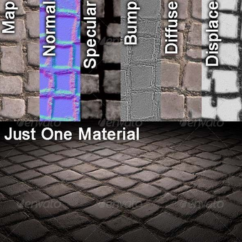

# Texture Coordinates

Generally referred to as UV coordinates or simply UVs
- 2D textures are sampled using 2D coordinates
- We refer to the axes of this coordinate system as the U axis and V axis


# Multiple Vertex Attributes

To render a triangle with a texture mapped to it, each vertex needs a uv coordinate


UV coordinates will be:
- stored as floats in VBO
- assigned to a varying in the vertex shader    
- interpolated between fragments    
- used in fragment shader to look up values in textures

#### Single Attribute

Up to now, we only had a single attribute for each vertex, which was the position. Now, we're going to need a second attribute, the UV coordinate. So, every vertex will now have 4 floats of data (x, y, u, v).

In order to setup our meshes for a single vertex, we did the following:

First, we copied all the positions (x,y) into a VBO

```c++
// Define our shape as positions made of 2 float each
float verts[] = { 0,0, 10,20, 20,0 };

// Copy our attribute data into the VBO
glBufferData( GL_ARRAY_BUFFER, (sizeof(float)*2)*3, verts, GL_STATIC_DRAW );
```

Then we described this one attribute to OpenGL

```c++
// Describe the attributes in the VBO to OpenGL
glVertexAttribPointer( pos, 2, GL_FLOAT, GL_FALSE, 8, (void*)0 );
```

#### Multiple Attributes

See [Extra Attributes](Extra%20Attributes.md) for another example

To handle 2+ attributes nicely, define the vertex format as a struct

```c++
// define a struct for our vertex format
struct VertexFormat
{
	float position[2];
	float uv[2];
};

// Define our shape as an array of VertexFormat structures
VertexFormat verts[] = { {  0, 0,   0.0f,0.0f },    // Vertex 0, pos and uv
                         { 10,20,   1.0f,0.0f },    // Vertex 1
                         { 20, 0,   0.5f,1.0f }, }; // Vertex 2

// Copy our attribute data into the VBO
glBufferData( GL_ARRAY_BUFFER, sizeof(VertexFormat)*3, verts, GL_STATIC_DRAW );
```

Then we describe the two attributes to OpenGL

```c++
// Setup Position:
GLint pos = glGetAttribLocation( m_pShader->m_Program, "a_Position" );
glEnableVertexAttribArray( pos );
glVertexAttribPointer( pos, 2, GL_FLOAT, GL_FALSE, 16, (void*)0 );

// Setup UV:
GLint uv = glGetAttribLocation( m_pShader->m_Program, "a_UVCoord" );
glEnableVertexAttribArray( uv );
glVertexAttribPointer( uv, 2, GL_FLOAT, GL_FALSE, 16, (void*)8 );
```

The 16 in this block is the stride of each vertex, this indicates to the renderer how many bytes separate each set of vertex attributes.
i.e. If we find the first position at byte 0, the next position will be at byte 16, then 32, 48, 64, etc...

The last parameter is the starting offset into the buffer.
i.e. The first position starts at byte 0, and the first uv starts at byte 8.

The (void*) is an unfortunate remnant from the days before VBOs were available.

# Vertex and Fragment Shader example

Pass the attributes to the fragment shader so it can sample the texture

**Vertex Shader**
```glsl
attribute vec2 a_Position;
attribute vec2 a_UVCoord;

varying vec2 v_UVCoord;

void main()
{
	gl_Position = vec4( a_Position, 0, 1 );

	v_UVCoord = a_UVCoord;
}
```

**Fragment Shader**
```glsl
varying vec2 v_UVCoord;

void main()
{
	// Output the UVs as colour
	// This example doesn’t sample the texture
	// Its meant to show that the UV are correctly being passed in
	vec4 colour = vec4( v_UVCoord, 0, 1 );

	gl_FragColor = colour;
}
```

# Sampling from Textures

Getting the UV coordinates to the fragment shader is only part of the process.

The entire process involves:
- passing a UV coordinate to the fragment shader for each vertex as a varying
- binding a texture buffer to a texture unit
- passing a texture unit number to the fragment shader as a uniform
- sampling the texture at the UV coordinate to get a colour

# Texture Units

Texture units will sample a texture at a UV coordinate and return a colour
- Technically, there are two sides to texture units
	- a texture mapping unit (TMU), which is a hardware texture sampler
	- a texture image unit (TIU), which is an OpenGL binding location
- Current video cards have anywhere from 4* to 196* physical TMUs
- OpenGL guarantees a minimum number of TIUs that we can bind textures to
- This number might be more or less than the number of hardware TMUs
- OpenGL will invisibly deal with this discrepancy
- In code, we work with TIUs and will generally refer to them as texture units

\* Numbers are made up and likely wildly inaccurate

# Texture Unit Bind Points

Each texture unit has multiple bind points for different kinds of textures
- GL_TEXTURE_1D
- GL_TEXTURE_2D <- \*
- GL_TEXTURE_3D
- GL_TEXTURE_2D_ARRAY
- GL_TEXTURE_CUBE_MAP <- \*
- etc...

\* These 2 are the most commonly used and are the only two available in OpenGL ES 2

# CODE: Creating a Texture

The following steps are required to create a texture in OpenGL

```c++
// Create a texture buffer.
GLuint textureID;
glGenTextures( 1, &textureID );

// Set texture unit 0 to be the current active one.
int textureUnitIndex = 0;
glActiveTexture( GL_TEXTURE0 + textureUnitIndex );

// Bind the texture to the GL_TEXTURE_2D target of the active TIU.
glBindTexture( GL_TEXTURE_2D, textureID );

// Fill the texture buffer with pixel information from "buffer".
glTexImage2D( GL_TEXTURE_2D, 0, GL_RGBA, width, height, 0, GL_RGBA,
              GL_UNSIGNED_BYTE, buffer );

// Disable mipmaps.
glTexParameteri( GL_TEXTURE_2D, GL_TEXTURE_MAG_FILTER, GL_NEAREST );
glTexParameteri( GL_TEXTURE_2D, GL_TEXTURE_MIN_FILTER, GL_NEAREST );

// Unbind the texture on the GL_TEXTURE_2D target of the active TIU.
glBindTexture( GL_TEXTURE_2D, 0 );
```

# Sampling a Texture

In our fragment shader, we can sample a texture at a given UV Coordinate.

For example, if we sample at (0.5, 0.75), we get the following:


To get a colour we need to know which texture and where to sample from.

First, to we tell OpenGL which texture to use in C++:
- Bind our texture to a texture unit
- Program a uniform with the texture unit number we bound our texture to

Then, we get the colour from the texture in our fragment shader:
- Define a uniform of type "sampler2D"
- Call texture2D() with the sampler and a UV coordinate as arguments

# CODE: Fragment Shader sampler2D

Example of a sampler2D uniform in a fragment shader.

```glsl
uniform sampler2D u_TextureSampler;

varying vec2 v_UVCoord;

void main()
{
    // sample the texture at the interpolated UV coordinate
    vec4 colour = texture2D( u_TextureSampler, v_UVCoord );

    gl_FragColor = colour;
}
```

# CODE: Programming a Texture Sampler Uniform

The following steps are required to program a sampler2D uniform in OpenGL.

```c++
// Set texture unit 5 to be the current active TIU
int textureUnitIndex = 5; // I picked 5 at random for demo purposes.
glActiveTexture( GL_TEXTURE0 + textureUnitIndex );

// Bind the texture to the GL_TEXTURE_2D target of the active TIU
glBindTexture( GL_TEXTURE_2D, textureID );

// Get the uniform location and fill it with the texture unit number
GLint loc = glGetUniformLocation( shaderProgram, "u_TextureSampler" );
glUniform1i( loc, textureUnitIndex );
```

NOTE: The uniform for a "sampler2D" type is an int, so set it's value with glUniform1i

# Different GameObjects with Different Textures

For simplicity, we'll use a single texture unit for all of our textures

For example, when drawing a GameObject with a Megaman texture, we'll bind that texture to texture unit 0 and draw

```c++
glActiveTexture( GL_TEXTURE0 + 0 ); // Select texture unit 0
glBindTexture( GL_TEXTURE_2D, 6 ); // Bind texture 6 to the 2D target of texture unit 0

Setup Uniforms
Setup Attributes

Draw
```

Later, when drawing a different GameObject with a different texture, we'll change which texture is bound to texture unit 0 before drawing that object

# Multiple Textures Simultaneously

For cases where we need more than one texture at the same time, like a Diffuse map, a Normal map and a Specular Map, we'll bind each of the textures to a different texture unit and declare 3 sampler2D uniforms in our shader

```
glActiveTexture( GL_TEXTURE0 + 0 );
glBindTexture( GL_TEXTURE_2D, DiffuseMap_TextureID );
Setup u_DiffuseTextureSampler

glActiveTexture( GL_TEXTURE0 + 1 );
glBindTexture( GL_TEXTURE_2D, NormalMap_TextureID );
Setup u_NormalTextureSampler

Draw
```



# Exercises

- Create a box with UVs that range from (0,0) to (1,1)
- Display a texture on that box
- Load 2 textures and in code display one or the other by pressing a key
- Do some math with the UVs in the fragment shader and try to:
	- make the texture scroll horizontally
	- make the texture scroll vertically
	- make the texture swirl around
- Pass 2 textures to the fragment shader at once and show one on the left side of your box and the other on the right half
- Sample both textures and blend the colors together
