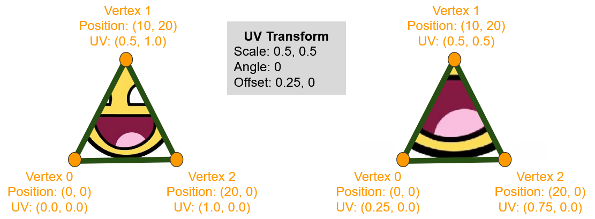
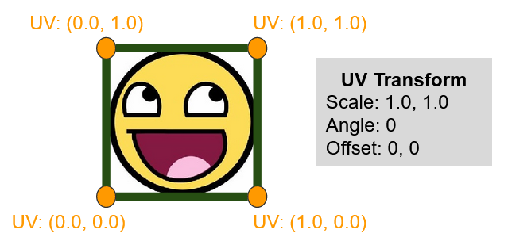
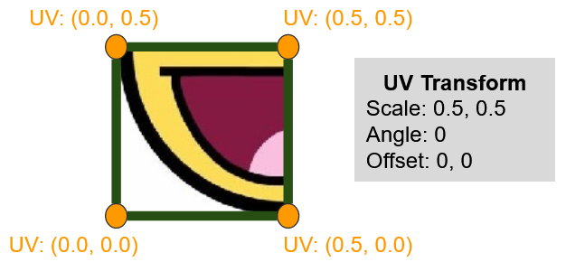
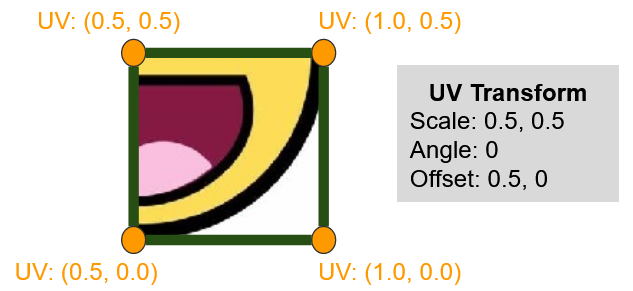

# Transforming Texture Coordinates

Texture coordinates, just like positions, can be transformed with uniforms.



In your vertex shader, the UV coordinates can be scaled and offset like this:

```glsl
	v_UVCoord = a_UVCoord * u_UVScale + u_UVOffset;
```

Both new uniforms are vec2 type allowing us to choose a portion of a texture to display on our shape

#### Starting with a simple mesh with UVs ranging from 0 to 1



We can choose to display only the bottom left corner of the texture



Similarly, we can display the bottom right corner



# Sprite Strips and Sprite Sheets

Using this technique we can pick out a single sprite from a spritesheet:
- UV Scale = sprite size / texture sheet size
- UV Offset = sprite position on sheet / texture sheet size

For example,


In this image, each number is 24x24 and the entire image is 240x24.

So, to display the number 0, we need the following scale and offset values:

```
UV Scale X = 24/240
UV Scale Y = 24/24

UV Offset X = 0/240
UV Offset Y = 0/24

This would evaluate to
UVScale = vec2( 0.1, 1 );
UVOffset = vec2( 0, 0 );
```

to display the number 5, we'd need these values:

```
UV Scale X = 24/240
UV Scale Y = 24/24

UV Offset X = 120/240
UV Offset Y = 0/24

This would evaluate to
UVScale = vec2( 0.1, 1 );
UVOffset = vec2( 0.5, 0 );
```

This would apply the same way for spritesheets, except the position and sizes of each sprite in the spritesheet would be less regular. To explicitly give an example, if a sprite in the 256x128 spritesheet had a size of 16x32 and a position of (17, 63), we'd calculate the values as follows:

```
UV Scale X = 16/256
UV Scale Y = 32/128

UV Offset X = 17/256
UV Offset Y = 63/128
```

# Packing it into a vec4 for convenience

We can fit 4 number in a single vec4, which would mean only passing one uniform into the vertex shader instead of 2. We could call this a UV Transform instead, but keep in mind it doesn't handle rotation, for rotation we'd need a 3x2 matrix of values.

```c++
	// Done the long way for clarity.
	vec4 UVTransform;
	UVTransform.x = UVScale.x;
	UVTransform.y = UVScale.y;
	UVTransform.z = UVOffset.x;
	UVTransform.w = UVOffset.y;
```

Then in the shader:

```glsl
	v_UVCoord = a_UVCoord * u_UVTransform.xy + u_UVTransform.zw;
```
