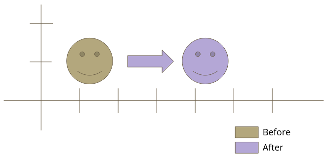
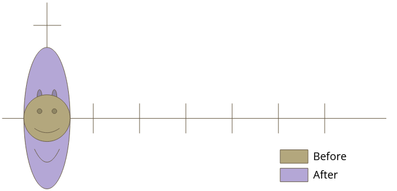
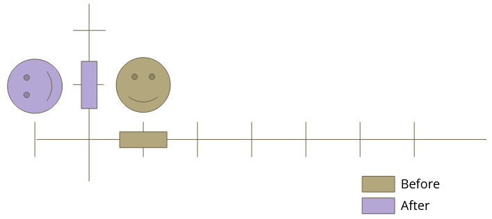

# Transformation Matrix

#### Identity matrix

Multiplying a matrix or vector by an identity matrix is the equivalent of multiplying a number by 1

| Identity Matrix |  |  |  |  |  |
| :--: | :--: | :--: | :--: | :--: | ---- |
|  | 1 | 0 | 0 | 0 |  |
|  | 0 | 1 | 0 | 0 |  |
|  | 0 | 0 | 1 | 0 |  |
|  | 0 | 0 | 0 | 1 |  |
|  |  |  |  |  |  |

#### Transforming a vector by a matrix

|  |  |  |  |  |  |  |  |  |  |
| :--: | :--: | :--: | :--: | :--: | :--: | :--: | :--: | :--: | ---- |
|  | 1 | 0 | 0 | 0 |  | X |  | newX |  |
|  | 0 | 1 | 0 | 0 | * | Y | = | newY |  |
|  | 0 | 0 | 1 | 0 |  | Z |  | newZ |  |
|  | 0 | 0 | 0 | 1 |  | W |  | newW |  |
|  |  |  |  |  |  |  |  |  |  |

In other notation:

```
newX = vec4( 1, 0, 0, 0 ) * vec4( X, Y, Z, W )
newY = vec4( 0, 1, 0, 0 ) * vec4( X, Y, Z, W )
newZ = vec4( 0, 0, 1, 0 ) * vec4( X, Y, Z, W )
newW = vec4( 0, 0, 0, 1 ) * vec4( X, Y, Z, W )
```

Each of those multiplies is a dot product. i.e.
```
v1.x*v2.x + v1.y*v2.y + v1.z*v2.z + v1.w*v2.w
```

# Translation

Translating a position in space will simple offset the values. In this case, the ‘W’ must be 1

|  |  |  |  |  |  |  |  |  |  |
| :--: | :--: | :--: | :--: | :--: | :--: | :--: | :--: | :--: | ---- |
|  | 1 | 0 | 0 | X Offset |  | X |  | newX |  |
|  | 0 | 1 | 0 | Y Offset | * | Y | = | newY |  |
|  | 0 | 0 | 1 | Z Offset |  | Z |  | newZ |  |
|  | 0 | 0 | 0 | 1 |  | W = 1 |  | newW |  |
|  |  |  |  |  |  |  |  |  |  |

#### Example: Translation on the X axis
Each point in the original shape got moved 3 units to the right



|  |  |  |  |  |  |  |  |  |  |
| :--: | :--: | :--: | :--: | :--: | :--: | :--: | :--: | :--: | ---- |
|  | 1 | 0 | 0 | 3 |  | X |  | 1\*X + 3\*W |  |
|  | 0 | 1 | 0 | 0 | * | Y | = | 1\*Y |  |
|  | 0 | 0 | 1 | 0 |  | Z |  | 1\*Z |  |
|  | 0 | 0 | 0 | 1 |  | W = 1 |  | 1\*W |  |
|  |  |  |  |  |  |  |  |  |  |

# Scale

A scale matrix will increase the values in our vector by a multiple of their original value

|  |  |  |  |  |  |  |  |  |  |
| :--: | :--: | :--: | :--: | :--: | :--: | :--: | :--: | :--: | ---- |
|  | Scale X | 0 | 0 | 0 |  | X |  | newX |  |
|  | 0 | Scale Y | 0 | 0 | * | Y | = | newY |  |
|  | 0 | 0 | Scale Z | 0 |  | Z |  | newZ |  |
|  | 0 | 0 | 0 | 1 |  | W |  | newW |  |
|  |  |  |  |  |  |  |  |  |  |

#### Example: Scale on the Y axis
In this example, we scale the original Y value by 3, but leave the X and Z as they were



|  |  |  |  |  |  |  |  |  |  |
| :--: | :--: | :--: | :--: | :--: | :--: | :--: | :--: | :--: | ---- |
|  | 1 | 0 | 0 | 0 |  | X |  | 1\*X |  |
|  | 0 | 3 | 0 | 0 | * | Y | = | 3\*Y |  |
|  | 0 | 0 | 1 | 0 |  | Z |  | 1\*Z |  |
|  | 0 | 0 | 0 | 1 |  | W = 1 |  | 1\*W |  |
|  |  |  |  |  |  |  |  |  |  |

# Rotation

Depending on which axis you want to rotate around, you need to construct different matrices

|  |  |  |  |  |  |  |  |  |  |
| :--: | :--: | :--: | :--: | :--: | :--: | :--: | :--: | :--: | ---- |
|  | Y/Z | Z | Y | 0 |  | X |  | newX |  |
|  | Z | X/Z | X | 0 | * | Y | = | newY |  |
|  | Y | X | X/Y | 0 |  | Z |  | newZ |  |
|  | 0 | 0 | 0 | 1 |  | W |  | newW |  |
|  |  |  |  |  |  |  |  |  |  |

#### Rotation on the Z axis
For this example, we’ll pass degrees into the sin() and cos() functions.  Normally you use radians



|  |  |  |  |  |  |  |  |  |  |
| :--: | :--: | :--: | :--: | :--: | :--: | :--: | :--: | :--: | ---- |
|  | cos(90)<br>= 0 | -sin(90)<br>= -1 | 0 | 0 |  | X |  | -Y |  |
|  | sin(90)<br>= 1 | cos(90)<br>= 0 | 0 | 0 | * | Y | = | X |  |
|  | 0 | 0 | 1 | 0 |  | Z |  | Z |  |
|  | 0 | 0 | 0 | 1 |  | W |  | W |  |
|  |  |  |  |  |  |  |  |  |  |

#### Rotation on the X axis
The X axis rotation matrix is similar, but doesn’t affect the X value of the original vector

|  |  |  |  |  |  |  |  |  |  |
| :--: | :--: | :--: | :--: | :--: | :--: | :--: | :--: | :--: | ---- |
|  | 1 | 0 | 0 | 0 |  | X |  | X |  |
|  | 0 | cos(90)<br>= 0 | -sin(90)<br>= -1 | 0 | * | Y | = | -Z |  |
|  | 0 | sin(90)<br>= 1 | cos(90)<br>= 0 | 0 |  | Z |  | Y |  |
|  | 0 | 0 | 0 | 1 |  | W |  | W |  |
|  |  |  |  |  |  |  |  |  |  |

#### Rotation on the Y axis
Same with the Y axis rotation matrix, the Y value of the original vector is untouched

|  |  |  |  |  |  |  |  |  |  |
| :--: | :--: | :--: | :--: | :--: | :--: | :--: | :--: | :--: | ---- |
|  | cos(90)<br>= 0 | 0 | sin(90)<br>= 1 | 0 |  | X |  | Z |  |
|  | 0 | 1 | 0 | 0 | * | Y | = | Y |  |
|  | -sin(90)<br>= -1 | 0 | cos(90)<br>= 0 | 0 |  | Z |  | -X |  |
|  | 0 | 0 | 0 | 1 |  | W |  | W |  |
|  |  |  |  |  |  |  |  |  |  |

# Example: Translation and Scale combines

A single matrix can do any combination of Scaling/Rotation/Translation

|  |  |  |  |  |  |  |  |  |  |
| :--: | :--: | :--: | :--: | :--: | :--: | :--: | :--: | :--: | ---- |
|  | 2 | 0 | 0 | 5 |  | X |  | 2\*X + 5 |  |
|  | 0 | 3 | 0 | 6 | * | Y | = | 3\*Y + 6 |  |
|  | 0 | 0 | 4 | 7 |  | Z |  | 4\*Z + 7 |  |
|  | 0 | 0 | 0 | 1 |  | W = 1 |  | W |  |
|  |  |  |  |  |  |  |  |  |  |

# Old code to translate from object to clip space

Note: This code doesn’t handle object rotation, camera rotation/scale or perspective projection

```glsl
attribute vec2 a_Position;

void main()
{
	vec2 objectPos = a_Position;
	vec2 worldPos = objectPos * u_Scale + u_Translate; // Object scale and translation
	vec2 viewPos = worldPos - u_CameraPos; // Apply camera translation
	vec2 clipPos = viewPos * u_ProjScale; // Apply projection scale.
	
	gl_Position = vec4( clipPos, 0, 1 );
}
```

# New code to translate from object to clip space 

```glsl
attribute vec2 a_Position;
uniform mat4 u_matWorld;
uniform mat4 u_matView;
uniform mat4 u_matProj;

void main()
{
	vec4 objectPos = vec4( a_Position, 0, 1 );
	vec4 worldPos = u_matWorld * objectPos; // Apply world transform.
	vec4 viewPos  = u_matView * worldPos;   // Apply view transform.
	vec4 finalPos = u_matProj * viewPos;    // Apply projection transform.  
	
	gl_Position = finalPos;
}
```

See [bgfx Shaders](bgfx%20Shaders.md) for more info on converting the glsl above to BGFX shader language.

# Creating a transform matrix in c++

```c++
	mat4 worldMatrix;
	worldMatrix.CreateSRT( m_Scale, m_Rotation, m_Position );
```

# Passing matrix to a shader

Create a new uniform:
```c++
    m_pUniforms->CreateUniform( "u_MatWorld", bgfx::UniformType::Mat4 );
```

Set the value:
```c++
	mat4 worldMatrix;
	worldMatrix.CreateSRT( m_Scale, m_Rotation, m_Position );
	bgfx::setUniform( pUniforms->GetUniform("u_MatWorld"), &worldMatrix.m11 );
```
