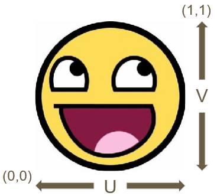
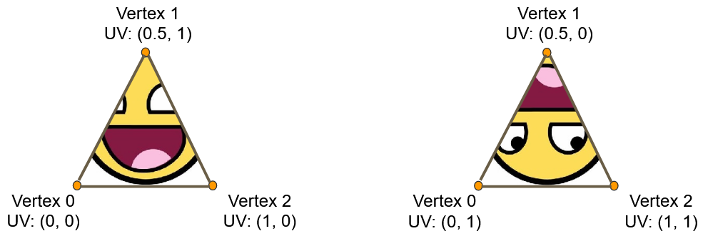

UV Coordinates are used to map a texture to the vertices in the shape.

To display the entire texture once, you need to query values in the range from (0, 0) to (1, 1)

By specifying different values per vertex, you can decide how the texture is mapped to triangles.

