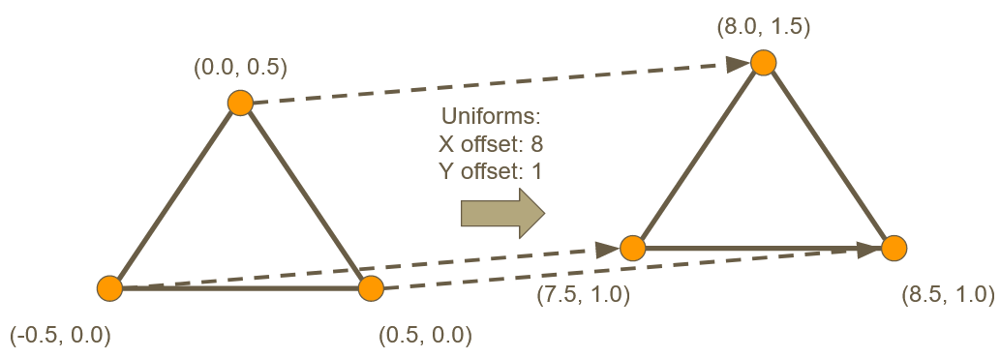
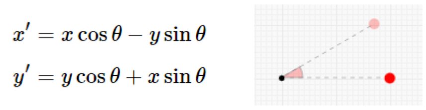

# What are Uniforms?

- “Constant” values that are set by the user
- The value will remain the same for every vertex in the mesh
- Can be altered in C++ between draw calls
- Cannot be set or modified while the shader program is running

# Moving a Mesh

- A mesh is made up of a number of vertices
- Each vertex has a set position
	- We decide these manually when building the mesh and storing it's attributes into the VBO
- We can offset the location of each vertex by passing in a uniform
	- The vertex shader don't change the contents of the VBO
	- It just transforms them for that one draw call



# GLSL: Offset Uniform Example With Errors

```glsl
attribute vec2 a_Position;
uniform vec2 u_Offset;

void main()
{
    a_Position += u_Offset; <- Error: Cannot modify input variables

    gl_Position = vec4( a_Position, 0, 1 ); <- Error: 0 & 1 should be floats
}
```
Not all GLSL compilers are as strict, so this code may work on some machines and fail on others.

# GLSL: Offset Uniform Example

This version should run on everything:

```glsl
attribute vec2 a_Position;
uniform vec2 u_Offset;

void main()
{
    vec2 finalPos = a_Position + u_Offset;

    gl_Position = vec4( finalPos, 0.0, 1.0 );
}
```

# Uniform Table

All uniforms declared are stored in a table inside the shader.
Each shader we load has its own table, so values would need to be set in each of them.


# Programming a Uniform

**In the vertex shader file (GLSL):**
- Define the uniform
	- `uniform vec2 u_Offset;`

**In your game code after the shader has been activated (C++):**
- Get the uniform location/index from the table (as shown above)
	- `GLint offsetLoc = glGetUniformLocation( programHandle, “u_Offset” );`
- Set the value for the uniform
	- `glUniform2f( offsetLoc, 1, 0 );`

# Program Flow Example

```c++
// Start using this shader program
glUseProgram( programHandle );

// Setup the shader’s uniform and draw a triangle at (0,0)
glUniform2f( offsetLoc, 0.0f, 0.0f );
DrawTriangle();

// Set the uniform again and draw a triangle at (5,0)
glUniform2f( offsetLoc, 5.0f, 0.0f );
DrawTriangle();
```

# Rotation

Remember, each vertex is transformed separately by the vertex shader
Each point can be rotated around the (0, 0) point as follows:


Interactive website: https://academo.org/demos/rotation-about-point/

# Important Functions/Keywords

in C++:
- glGetUniformLocation
- glUniform1f, 2f, 3f, 4f
in GLSL:
- gl_Position
- uniform
