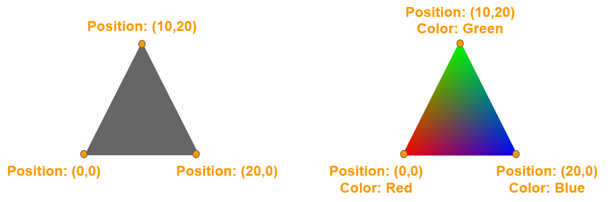
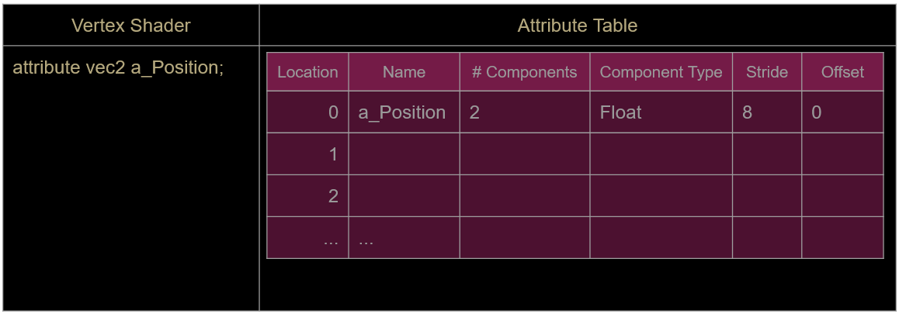

Vertices contain many pieces of data, called attributes.
The key attribute of a vertex is its position, a vertex can’t exist without it.
All vertices in a mesh must have the same set of attributes.
Different meshes can have a different set of attributes.

Common attributes:
- Position
- Color
- Normal
- Texture/UV coordinates




# Implementation Details

#### Vertex Buffer Object (VBO)

This is simply a block of memory that contains the attributes for all the vertices of a mesh

If you have a Mesh that only has 2D positions, the contents of the VBO could look like this for a single triangle with 3 points:

```
0.0f, 0.0f, 10.0f, 20.0f, 20.0f, 0.0f
```

The buffer above is what it looks like to use that knows all the values are floats, but since we can mix many data types in one buffer, we should think of it looking more like this:

```
00 00 00 00 00 00 00 00 00 00 20 41 00 00 A0 41 00 00 A0 41 00 00 00 00
```

i.e. just a bunch of hexademical pairs, each pair representing 1 byte and 4 pairs representing a single floating point number.

#### Minimum steps needed to draw something

At load time:
- Create a vertex buffer object (VBO)
- Fill the VBO with the attributes of all the vertices in the mesh

Each frame for each mesh drawn:
- Activate a VBO
- Tell the GPU how to read the attributes from the VBO
- Draw by picking which primitive type and which vertices to draw with

#### Creating and Filling a VBO

```c++
// Declare a VBO, which is just a number.
// This shouldn't be on the stack, it needs to persist between frames.
GLuint m_VBO;
```

```c++
// Generate a buffer for our vertex attributes.
glGenBuffers( 1, &m_VBO );

// Set this VBO to be the currently active one.
glBindBuffer( GL_ARRAY_BUFFER, m_VBO );

// Define our triangle as 3 positions.
// This can be done on the stack, since it's temporary.
float attribs[] = { 0, 0, 10, 20, 20, 0 };

// Copy our attribute data into the VBO.
// Once copied into the VBO, the stack copy above isn't needed anymore.
glBufferData( GL_ARRAY_BUFFER, sizeof(float)*6, attribs, GL_STATIC_DRAW );
```

#### Drawing a Shape using the Contents of a VBO

```c++
// Set this VBO to be the currently active one.
glBindBuffer( GL_ARRAY_BUFFER, m_VBO );

// Get the attribute variable’s location from the shader.
// The shader part is commented out here, we'll discuss that later.
GLint loc = 0; //glGetAttribLocation( m_pShader->m_Program, "a_Position" );
glEnableVertexAttribArray( loc );

// Describe the attributes in the VBO to OpenGL.
glVertexAttribPointer( loc, 2, GL_FLOAT, GL_FALSE, 8, (void*)0 );

// Draw the primitive.
glDrawArrays( GL_TRIANGLES, 0, 3 );
```

#### Attribute Table



The `glVertexAttribPointer` line above is the most complex part. It describes to the video card how to read the data from our buffer.

Keep in mind our buffer just looks like this to the video card:

```
00 00 00 00 00 00 00 00 00 00 20 41 00 00 A0 41 00 00 A0 41 00 00 00 00
```

It has no clue if those are ints, floats, chars, or other types, but we know that all the values are floats, and that they come in pairs for the x,y position of each vertex. Something like this:

```
|       vertex 0        |       vertex 1        |       vertex 2        |
|    X      |     Y     |    X      |     Y     |    X      |     Y     |
|00 00 00 00|00 00 00 00|00 00 20 41|00 00 A0 41|00 00 A0 41|00 00 00 00|
```

So, we need to give it enough information about how our data is formatted so it can use it.

#### Attribute Setup Code

The code to set this up starts with

```c++
GLint loc = 0;
glEnableVertexAttribArray( loc );
```

This says the first attribute in our buffer is an array of values, as opposed to a single shared value for all vertices. This should almost always be set to enabled for each attribute. There are special cases where it's not enabled, but that's usually due to a mismatch between the attributes in the VBO and the attributes the shader is using to draw the mesh (more on shaders later).

Once the array is enabled, we describe how to interpret that block of hexadecimal values.
The following call must be made to describe the VBO contents to OpenGL, using this function:

```c++
glVertexAttribPointer( loc, 2, GL_FLOAT, GL_FALSE, 8, (void*)0 );
```

In plain english: Attribute **0** (loc) is made up of **2 floats**, we don't want to normalize them (GL_FALSE), each pair is **8 bytes** apart from each other in our buffer and they start at **byte 0** of the VBO (i.e. the position data is at the start of the buffer).

#### glVertexAttribPointer Prototype

From the docs, this is the actual function prototype:

```c++
void glVertexAttribPointer(GLuint index, GLint size, GLenum type,
						   GLboolean normalized, GLsizei stride,
						   const GLvoid* pointer);
```

- **index**: the index into the attribute table
- **size**: the # of components in this attribute
- **type**: the datatype of the attribute
- **normalized**: whether the data should be transformed into a 0-1 range
- **stride**: number of bytes to advance to get to the next vertex
- **pointer**: offset into the buffer of the attribute for the first vertex

#### Note

All vertex positions need to land inside [Clip Space](Clip%20Space.md), otherwise they won't be visible. If a line or triangle extends from inside clip space to outside, you'll only see the part that's inside.

# Reference

[OpenGL References](OpenGL%20References.md)

# Related Functions

Look up the details of the following functions in the ref pages:
- glGenBuffers
- glBindBuffer
- glBufferData
- glGetAttribLocation
- glEnableVertexAttribArray
- glVertexAttribPointer
- glDrawArrays
- glPointSize
- glLineWidth

# Exercises

- Create the following shapes using the specified primitive type and one call to glDrawArrays:
	- A star using a line loop
	- The triforce using triangles
	- A diamond using a triangle fan
	- A grid of 10x10 dots using points
- Add the vertices for multiple shapes into the same VBO and draw them with separate calls to glDrawArrays (check the docs for details on the arguments for glDrawArrays)
