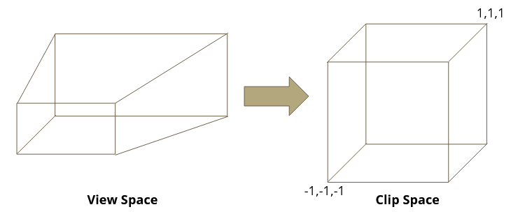
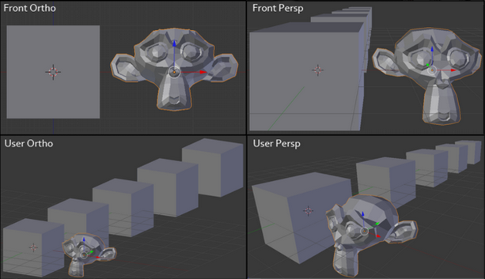
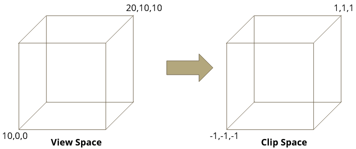

See [Transforms](Transforms.md)

# Creating a view matrix

The view matrix is always the inverse of the camera’s position, rotation and scale.

The view matrix can be created manually, like this:
```c++
mat4 viewMatrix;
viewMatrix.SetIdentity();
viewMatrix.Rotate( 10, 1, 0, 0 ); // Camera is looking 10 degrees down.
viewMatrix.Translate( 0, 4, 0 );  // Camera is 4 units above the ground.
viewMatrix.Inverse();             // Inverse the matrix.

// or
viewMatrix.CreateSRT( vec3(1,1,1), vec3(10,0,0), vec3(0,4,0) );
viewMatrix.Inverse();
```

But you should try to use this helper function instead:
```c++
mat4 viewMatrix;
viewMatrix.CreateLookAtView( eye, up, at );
```

The 3 parameters to this function are:
- **Eye**: The 3d position of the camera
- **Up**: A direction vector that controls the "roll" of the camera
	- In 3d space, a camera facing any direction other than straight down will often have this set to 0,1,0 if the camera has no "roll"
	- If the camera were looking straight down, this vector would point in the direction you want the top of the camera to be
- **At**: A position is 3d space that the camera is looking at

Using these 3 parameters, the function will generate a matrix that will set the cameras position to the "eye" position, but also have the "yaw"(Y angle) and "pitch"(X angle) values set correctly based on what the camera is looking at, and have the "roll"(Z angle) set correctly based on the "up" vector.

# Projection Matrix

Projection matrices are used to take a piece of the world and fit it into clip space. This allows us to decide what shows up on screen.



# Orthographic vs Perspective



# Orthographic Projection

Orthographic projections are used to draw a scene with no perspective. i.e. objects in the distance don’t get smaller.



# Orthographic Projection Matrix

The simplest orthographic projection matrix is as follows:

| Basic Ortho Matrix |  |  |  |  |  |
| :--: | :--: | :--: | :--: | :--: | ---- |
|  | 1 | 0 | 0 | 0 |  |
|  | 0 | 1 | 0 | 0 |  |
|  | 0 | 0 | 0 | 0 |  |
|  | 0 | 0 | 0 | 1 |  |
|  |  |  |  |  |  |

As you can imagine, this will draw the -1 to 1 X/Y range of our view space and set all Z values to 0.

# Orthographic Projection Matrix

Generally you specify a right, left, top, bottom, near and far value when creating this matrix.

| Ortho Matrix |  |  |  |  |  |
| :--: | :--: | :--: | :--: | ---: | ---- |
|  | 2<br>---------<br>right-left | 0 | 0 | right+left<br>-   ---------<br>right-left |  |
|  | 0 | 2<br>---------<br>top-bottom | 0 | top+bottom<br>-   ---------<br>top-bottom |  |
|  | 0 | 0 | 2<br>---------<br>far-near | far+near<br>-   ---------<br>far-near |  |
|  | 0 | 0 | 0 | 1 |  |
|  |  |  |  |  |  |

# Perspective Projection

Perspective projections will cause objects further in the distance to appear smaller on screen.


# Perspective Projection Matrix

Provide a vertical field of view, an aspect ratio and near/far z values to create this matrix.

| Perspective Matrix |  |  |  |  |  |
| :--: | :--: | :--: | :--: | :--: | ---- |
|  | 1<br>---------<br>aspect\*tan(fov/2) | 0 | 0 | 0 |  |
|  | 0 | 1<br>---------<br>tan(fov/2) | 0 | 0 |  |
|  | 0 | 0 | -near - far<br>---------<br>near - far | 2 \* near \* far<br>---------<br>near - far |  |
|  | 0 | 0 | 1 | 0 |  |
|  |  |  |  |  |  |

Note: As you can see, the new W is now the old Z

# Creating a projection matrix

Projection matrices can be one of two types. Orthographic or Perspective.

```c++
mat4 projMatrix;

// Orthographic matrix that shows vertices between (-5,-5,0) and (5,5,100).
projMatrix.CreateOrtho( -5, 5, -5, 5, 0, 100 );

// Perspective matrix that shows things up to 100 units in front of the camera and within 45 degrees vertically above and below where the camera is looking.  Aspect ratio is set to 1 for our square screen.
projMatrix.CreatePerspectiveVFoV( 45, 1, 0.01, 100 );
```

# Transform a position from model to clip space

```glsl
// This is GLSL shader code. See note below.

attribute vec3 a_Position;
uniform mat4 u_matWorld;
uniform mat4 u_matView;
uniform mat4 u_matProj;

void main()
{
	vec4 objectPos = vec4( a_Position, 1 );
	vec4 worldPos = u_matWorld * objectPos; // Apply world transform.
	vec4 viewPos  = u_matView * worldPos;   // Apply view transform.
	vec4 finalPos = u_matProj * viewPos;    // Apply projection transform.
	
	gl_Position = finalPos;
}
```

**Note**: See [bgfx Shaders](bgfx%20Shaders.md) for more info on converting the glsl above to BGFX shader language.

# Clip space or not clip space

We’ve referred to clip space as a cube from (-1,-1,-1) to (1,1,1).

These are actually Normalized Device Coordinates (NDC) or “NDC space(?)”.

Clip space is actually a 4 dimensional space (X,Y,Z,W).

To move from Clip space to NDC space, the pipeline will divide the XYZ values by the W value during rasterization (after the vertex shader is run).

As seen in the perspective projection matrix, the clip space W value is simply the view space Z value.  So the further things are in Z, the smaller they appear.

# Clipping explanation from ‘derhass’

[http://stackoverflow.com/questions/18875218/opengl-clip-coordinate](http://stackoverflow.com/questions/18875218/opengl-clip-coordinate)

\[The\] w will vary per vertex. Most people imagine the clip space as the cube \[-1,1\]^3. However, that is not the clip space, but the normalized device space (NDC). You get from clip space to NDC by doing the perspective divide, so dividing each vertex by it's w component. So, in NDC, that clip condition would transform to -1 <= x/w <= 1. However, the clipping cannot be done in NDC (without extra information).

The problem here is that points which lie behind the camera would appear in front of the camera in NDC space. Think about it: x/w is the same as -x/-w. With a typical GL projection matrix, w_clip == z_eye of the vertex. Also, a point that lies in the camera plane (the plane parallel to the projection plane, but going through the camera itself) will have w=0 and you can't do any clipping after that divide. The solution is to always do the clipping before the divide, hence the clip space is called "clip space"...
