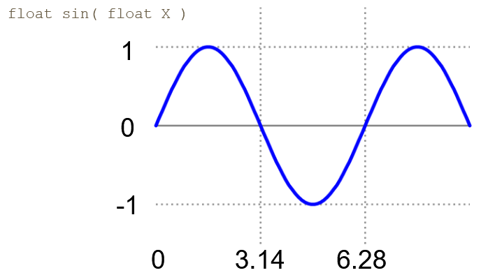
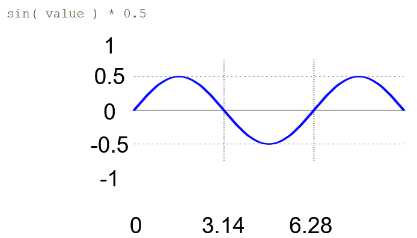
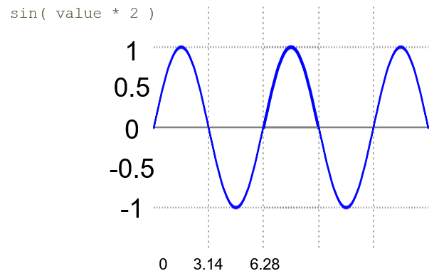
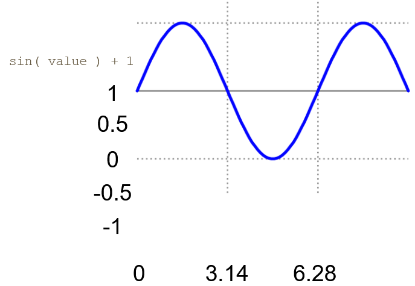
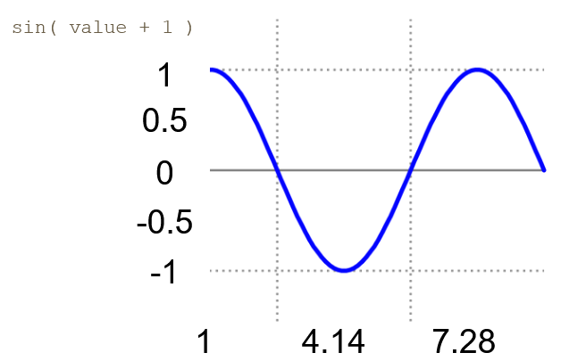

By passing in time to a shader, we can move the vertices around and animate those changes.

For example:
```glsl
objectSpacePosition.y += sin( objectSpacePosition.x + u_Time.x );
```

This of course can be done in object space or world space depending if the want the object to be deformed before you rotate it or after.

How the waves deform can be affected by how you use the sin functions

# Sin Waves

sin() takes in a value in radians and will return a value from -1 to 1



#### Amplitude Change

Scale by a constant outside the function: Changes the amplitude of the wave



#### Frequency Change

Scale by a constant inside the function: Changes the frequency of the wave



#### Sin Wave Shift Up/Down

Shift by a constant outside the function: Shifts the entire wave up/down



#### Sin Wave Shift Left/Right

Shift by a constant inside the function: Shifts the entire wave left/right


