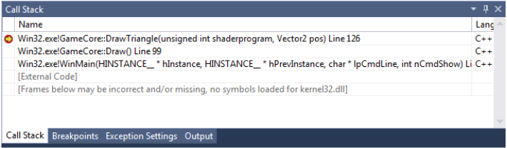
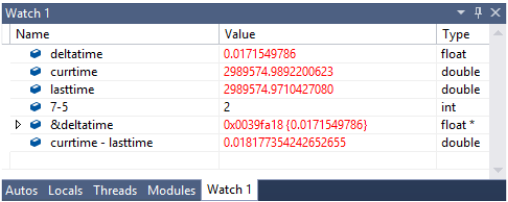
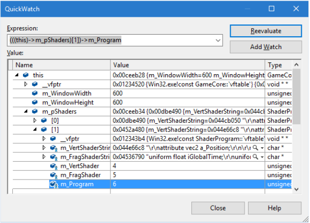
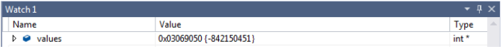
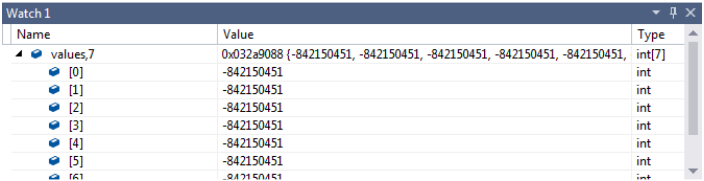
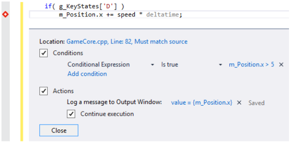
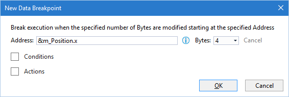

# Default Keyboard Mapping

Visual Studio allows you to set one of many default keyboard mapping.
These slides assume you are using the "Default" mapping scheme.

It can be changed here:  Tools -> Options -> Keyboard.

# Hotkeys

### Navigation

- F12 - Jump to definition
- Ctrl-Shift-8 - Reverse F12
- Ctrl-K, Ctrl-O - Toggle Header/Code file
	- might be worth rebinding to something simple, like Alt-S
- Ctrl-Tab - Switch between tabs (one tap for previous file)

Hotkeys can be changed in the Tools -> Options -> Keyboard menu

### Bookmarks

- Ctrl-K, Ctrl-K - enable/disable bookmark
- Ctrl-K, Ctrl-N - jump to next bookmark in solution
- Ctrl-K, Ctrl-P - jump to previous bookmark in solution
- Ctrl-K, Ctrl-L - delete all bookmarks

Consider remapping Ctrl-K, Ctrl-N to Edit.NextBookmarkInDocument and Ctrl-K, Ctrl-P to Edit.PreviousBookmarkInDocument

### Visual Studio Extensions

There are many useful extensions to Visual Studio
One simple but great free extension is "OpenFileInSolution"

It can be installed here:
	Tools -> Extensions and Updates -> Online -> "OpenFileInSolution"

by default it doesn't have a hotkey, but you can add one:
	Tools -> Options -> Keyboard -> "Tools.OpenFileInSolution" -> Alt-O -> Assign

### Compiling

- Ctrl-Shift-B - Build solution
- Ctrl-F7 - Build current cpp file (useful if many files don't compile)
- F8 - Jump to next syntax error/warning
- Shift-F8 - Jump to previous syntax error/warning

### Launching Game

- F5 - Launch debugger
- Shift-F5 - Stop debugger
- Ctrl-F5 - Run without debugger (sometimes useful for release builds)

### Breakpoints

- F9 - place a breakpoint
- Ctrl-F9 - enable/disable breakpoint, but keep it in list
- Ctrl-Shift-F9 - delete all breakpoints

### Debugging

- F10 - step over next line of code
- F11 - step into function/method
- Shift-F11 - Step out of current function/method

### Search

- Ctrl-F - Search current file
- F3 - Find next
- Shift-F3 - Find prev
- Ctrl-F3 - Search file for selected text
- Ctrl-Shift-F - Search entire solution
- F8 - Jump to next result
- Shift-F8 - Jump to previous result

- Search for a string in solution
	- press Ctrl-Shift-F
	- type in "thing to search for"
	- hit Enter
	- use F8 to cycle results

### Replace

Ctrl-H - Replace in current file
Ctrl-Shift-H - Replace in entire solution

# Asserts

Asserts can be used to verify certain conditions are met

These can be used in many ways, including:
- validation of parameters at the start of a function
- validation of results of the function
- make sure conditions are met at any time

# Assert Examples


```c++
void GameCore::OnEvent(Event& event)
{
	// Make sure the event is valid.
	assert( event.GetEventType() != EventType_NotSet );
}

GameObject* GameCore::FindObject(char* name)
{
	// Make sure the name passed in wasn't a nullptr
	//     and the first letter wasn't a terminating 0.
	assert( name != nullptr && name[0] != '\0' );
}

void GameCore::Update(float deltatime)
{
	// Use an assert if the Player object was required.
	// Don't use an assert if it's optional, in which case you'd use a null check.
	GameObject* pObject = FindObject( "Player" );
	assert( pObject != nullptr );
}
```

# OutputMessage: Variable number of arguments

```
void OutputMessage(const char* message, ...)
{
	char buffer[1024];
	va_list arg;
	va_start( arg, message );
	vsnprintf_s( buffer, 1024, _TRUNCATE, message, arg );
	va_end( arg );
	OutputDebugString( buffer );
}
```

This function can be used send formatted messages to the output window:

```
OutputMessage( "Player position: %0.2f, %0.2f\n", pos.x, pos.y );
```

# "printf" Debugging

Most common printf format specifiers:
%d - int
%f - float, can be formatted further with %0.2f, %.2f
%s - char array

# Call Stack

The call stack shows all the function calls made to reach the function our breakpoint was placed
You can double-click on any level of the call stack and look at the value of local variable at the time of the function call



# Watch Window

The watch window is similar to the Autos and Locals windows
The main difference is you can customize what you see
Experiment with it, you can add variables, expressions and more



# QuickWatch Window

The QuickWatch window is similar to the watch window for a single variable

Two common ways to access/use it:
- press Shift-F9, type "this" and hit enter
- or highlight a variable, press Shift-F9 and hit enter

It's useful for the following:
- quick keyboard navigation of large structures
- getting the full expression for a variable to paste into the watch window



# Viewing Arrays

If you have the following array declared:
	`int* values = new int[100];`

Viewing it in either watch window will only let you expand to see the 1st value


To see more values, do the following:


# Memory Signatures

0xCCCCCCCC - uninitialized stack memory
0xCDCDCDCD - uninitialized heap memory
0xFEEEFEEE - freed heap memory
0xDDDDDDDD - freed heap memory

# Conditional Breakpoints

You can right-click and add a condition to a breakpoint
You can also set it to output a message instead of breaking


Alternatively, you can just write a small block of code to do the same:
```c++
if( m_Position.x > 5 )
	int bp = 1;          <- add a breakpoint here
```
or,
```c++
if( m_Position.x > 5 )
	OutputMessage( "value = %f\n", m_Position.x );
```

# Data Breakpoints

Data breakpoints are much more powerful, they can help you find code that changes a value



To create a data breakpoint:
- Pause execution in the scope of the variable you want to track.  Use a regular breakpoint to do this
- In the Breakpoints window (Alt-F9) -> New -> Data Breakpoint…
- Type the expression giving the address you want to watch
	- &m_Position.x or similar
- Input how many bytes to watch at that location, depends on data type

Data breakpoints must be set each time you launch the program since variables are generally not at the same address.

# Debugging C++ OpenGL calls

OpenGL calls in C++ will set error flags if something went wrong
You won't know about an error flag unless you manually check
glGetError() will check if any of those flags are set
This will only show you if an error happened since the last check for errors
This function can be wrapped in a helper function like the CheckForGLErrors() function mentioned in the following slides to avoid too much code duplication.

With the following code, we don't know which of the 3 lines made the error

```
CheckForGLErrors();                      <- doesn't assert, all is good

GLint uObjectPos = glGetUniformLocation( shaderprogram, "u_ObjectPos" );
glUniform2f( uObjectPos, pos.x, pos.y );

glDrawArrays( GL_TRIANGLES, 0, 3 );

CheckForGLErrors();                      <- assert fails, there's an error
```

To improve this, temporarily call CheckForGLErrors() more often

```
CheckForGLErrors();
GLint uObjectPos = glGetUniformLocation( shaderprogram, "u_ObjectPos" );
CheckForGLErrors();
glUniform2f( uObjectPos, pos.x, pos.y );
CheckForGLErrors();                      <- assert fails, there's an error
glDrawArrays( GL_TRIANGLES, 0, 3 );
CheckForGLErrors();
```

Now we know the call to glUniform2f caused the error, it's likely that u_ObjectPos isn't a vec2

# Debugging OpenGL Shader Language errors

.vert and .frag files get compiled when the game is run

This happens inside ShaderProgram.cpp

If a shader fails to compile, the ShaderProgram class outputs the compiler log to the output window and breaks inside of ShaderProgram.cpp

If this happens, read your syntax errors in the output window

Errors will look different depending on your video card driver

Though, they will often start the same way:
```
ERROR: 0:9: 'finalpos' : syntax error
```

The 0:9 refers to the file chunk and the line number in the file chunk.  We are compiling a single shader code chunk, so the first number should always be 0

The output log won't say which file failed to compile, so check your call stack in C++ to find out which shader file, and if it's the .vert or .frag file that failed to compile

# Edit and Continue

Visual Studio allows you to change code while running and continue execution

To do this either:
- reach a breakpoint
- change some code
- continue execution
or
- change code and press Alt-F10 while the game is running

# Set Next Statement

When debugging, you can skip lines of code or move back to previous lines

Do this by right-clicking a line of code and selecting Set Next Statement
